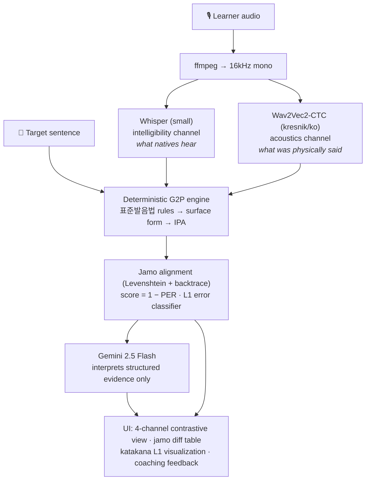
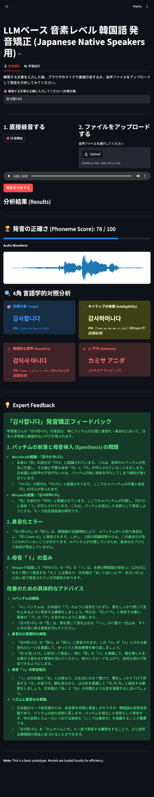

[🇰🇷 한국어 (Korean)](README_kr.md) | [🇯🇵 日本語 (Japanese)](README_jp.md)

# Phoneme-level Korean Pronunciation Coaching for Japanese Native Speakers 🧑‍🏫

[](https://github.com/fairyofdata/PhonemeJP2KR/actions/workflows/ci.yml)

[](https://youtu.be/4SwwmzEcpZQ)

> A CAPT (Computer-Assisted Pronunciation Training) web application for Japanese learners of Korean. It combines a **dual-ASR perception/production probe** (Whisper × Wav2Vec2), a **deterministic Korean G2P phonological rule engine**, and an **LLM interpretation layer** (Gemini) to detect, quantify, and explain pronunciation errors at the phoneme (jamo) level — with L1 interference made visible through katakana back-mapping.

---

## Table of Contents
1. [Problem Statement](#problem-statement)
2. [Design Principle](#design-principle)
3. [Architecture](#architecture)
4. [The Deterministic G2P Engine](#the-deterministic-g2p-engine)
5. [Scoring & L1 Error Taxonomy](#scoring--l1-error-taxonomy)
6. [Academic Background](#academic-background)
7. [Empirical Validation](#empirical-validation)
8. [Installation](#installation)
9. [Usage](#usage)
10. [Testing](#testing)
11. [Limitations & Roadmap](#limitations--roadmap)

---

## Problem Statement

Adult Japanese learners of Korean face a systematic obstacle rooted in phonology, not effort:

- **Mora-timed L1 rhythm** — Japanese phonotactics strongly prefer open (CV) syllables, so learners unconsciously repair Korean coda consonants (받침) by inserting epenthetic vowels (*밥* /pap̚/ → *バプ* [bapɯ]).
- **A two-way laryngeal contrast mapped onto a three-way one** — Japanese distinguishes voiced/voiceless; Korean distinguishes lenis/aspirated/tense (ㄱ/ㅋ/ㄲ). Learners collapse the triad.
- **Phonological deafness** — learners literally cannot hear the difference between what they produced and what they intended, because L1 perceptual categories filter the acoustic signal before it reaches awareness.

Generic pronunciation apps score "correct/incorrect" at the word level. That does not help a learner who cannot perceive *why* they were wrong. This project targets the perception gap itself.

## Design Principle

**The LLM never computes measurements.** A common failure mode of LLM-based language tools is asking the model to "transcribe to IPA and grade the pronunciation" — the output looks plausible but is non-deterministic, unreproducible, and hallucination-prone.

This system enforces a strict separation:

| Layer | Component | Property |
|---|---|---|
| **Measurement** | Rule-based G2P (표준발음법) + jamo alignment | Deterministic, unit-tested, reproducible |
| **Perception probe** | Whisper (strong internal LM) vs Wav2Vec2-CTC (no LM) | The *gap* between the two separates intelligibility from acoustics |
| **Interpretation** | Gemini 2.5 Flash, fed structured evidence (error tags, IPA, score) | Used only for pedagogy: katakana rendering + coaching text |

The same audio always yields the same score. If the LLM is unavailable, the full quantitative analysis still renders.

## Architecture



**Why dual ASR?** Whisper carries a strong language model, so it auto-corrects mispronunciations the way a native listener's brain does — its output approximates *intelligibility*. Wav2Vec2 with greedy CTC decoding has no language model, so its output stays close to the raw phone sequence — *acoustics*. The divergence between the two channels is precisely the "I can't hear my own mistake" gap that L2 learners suffer from, made measurable.

## The Deterministic G2P Engine

[`src/g2p.py`](src/g2p.py) implements the major phonological rules of Standard Korean (표준발음법) as a pure-Python pipeline over decomposed jamo, with no external dependencies:

| Rule | 표준발음법 | Example |
|---|---|---|
| ㅎ-aspiration / deletion | §12 | 좋다 → [조타], 좋아 → [조아], 입학 → [이팍] |
| Palatalization (구개음화) | §17 | 같이 → [가치], 굳이 → [구지] |
| Liaison (연음) | §13–14 | 한국어 → [한구거], 없어요 → [업써요] |
| Coda neutralization (7종성) | §8–11 | 부엌 → [부억], 있다 → [읻따] |
| Post-obstruent tensification | §23 | 학교 → [학꾜], 국밥 → [국빱] |
| Nasal / liquid assimilation | §18–20 | 합니다 → [함니다], 신라 → [실라], 독립 → [동닙] |

The surface form is then mapped to IPA with basic allophony (intervocalic lenis voicing /k/→[ɡ], ㅅ-palatalization [s]→[ɕ] before front glides): `만나서 반갑습니다` → `/mannasʌ panɡap̚s͈ɯmnida/`.

Because **both** the target and the ASR hypothesis pass through the same G2P, orthographic variance is neutralized — e.g. *감사합니다* and its surface spelling *감사함니다* score identically (100), as they should.

## Scoring & L1 Error Taxonomy

[`src/scoring.py`](src/scoring.py) aligns the two jamo sequences with Levenshtein dynamic programming (full backtrace) and computes **score = round(100 × (1 − PER))**. The alignment trace drives:

1. a per-phoneme diff table in the UI, and
2. a rule-based classifier tagging known Japanese-L1 interference patterns:

| Tag | Linguistic phenomenon | Example |
|---|---|---|
| `vowel_epenthesis` | Mora-timed CV repair after codas | 밥 → 바브 |
| `coda_deletion` | 받침 dropped entirely | 밥 → 바 |
| `laryngeal_confusion` | lenis/aspirated/tense collapse | 딸 → 달 |
| `vowel_ʌ_o_confusion` | ㅓ/ㅗ merger (no /ʌ/ in JP) | 서울 → 소울 |
| `vowel_ɯ_u_confusion` | ㅡ/ㅜ merger (no /ɯ/ in JP) | 그 → 구 |
| `nasal_coda_confusion` | ㄴ/ㅇ collapse into JP moraic ん | 산 → 상 |

These structured tags — not raw strings — are what the LLM receives, so its feedback cites concrete evidence instead of guessing.

## Academic Background

Phomene's architecture and rule-based classifier are strictly grounded in Contrastive Phonology literature. The rules implemented in `src/scoring.py` directly correspond to empirical studies on Japanese learners of Korean:

- **Syllabification and Vowel Epenthesis (`vowel_epenthesis`)**: Japanese learners unconsciously substitute Korean syllable-final consonants with Japanese *sokuon* (/Q/) or *hatsuon* (/N/), resulting in the resyllabification of CVC into CV.CV.
  - 🔗 [*중국어와 일본어 모어 화자의 한국어 음절 종성 산출 차이 연구* (Jang, 2016)](https://www.dbpia.co.kr/journal/articleDetail?nodeId=NODE10761462)
  - 🔗 [*음절 연쇄에서 나타나는 일본인 학습자의 한국어 종성 발음 유형* (Ha & Lee, 2019)](https://www.dbpia.co.kr/journal/articleDetail?nodeId=NODE09235049)
- **Over-assimilation (`nasal_coda_confusion`)**: Japanese learners tend to redundantly copy the place of articulation from the following consonant when nasalizing, leading to over-assimilation.
  - 🔗 [*한국어 비음화의 오류 유형과 원인 분석* (Lee, 2018)](https://www.dbpia.co.kr/journal/articleDetail?nodeId=NODE08838909)
- **Vowel Confusion (`vowel_ʌ_o_confusion`, `vowel_ɯ_u_confusion`)**: The structural differences in vowel inventory (e.g., absence of /ʌ/ and /ɯ/ in Japanese) cause systematic mergers.
  - 🔗 [*모음 체계와 자질에 의한 일본인 학습자의 한국어 모음 발음 분석* (2009)](https://www.kci.go.kr/kciportal/ci/sereArticleSearch/ciSereArtiView.kci?sereArticleSearchBean.artiId=ART002158469)
- **Dual-ASR Validation**: The limitation of single-ASR pronunciation assessment for L2 speakers has been recently formalized. Comparing Intended (Morphological/LM-driven) vs Actual (Acoustic) divergence is the robust path forward.
  - 🔗 [*형태소 분석기반 외국인 발화 한국어 발음평가 개선 방법* (Cho & Kim, 2023)](https://www.dbpia.co.kr/journal/articleDetail?nodeId=NODE11438586)

For the full list of referenced studies and abstracts, see [`docs/REFERENCES.md`](docs/REFERENCES.md).

## Empirical Validation

Four reproducible experiments ([`experiments/`](experiments/), full report in [docs/EVALUATION.md](docs/EVALUATION.md)):

| # | Question | Result |
|---|---|---|
| 1 | Is LLM-generated IPA a valid scorer? | **No** — on identical input, the v1 LLM scorer fluctuated 89–93 (sd 1.45) across 10 runs, producing 4 different IPA transcriptions of the same word. The deterministic scorer: sd 0.0. |
| 2 | Does the pipeline detect injected L1 errors? (TTS perturbation study) | **80% pairwise ranking accuracy** over 10 sentence pairs; mean gap 10.3 points. Both failures trace to the documented ASR-error confound and are analyzed in the report. |
| 3 | Does the G2P engine generalize beyond its dev examples? | **100% (51/51)** on a held-out 표준발음법 set; 0/9 on morphology-dependent items, exactly matching the documented scope. Runs in CI as a regression gate. |
| 4 | Does the score track error *severity*? (graded 0–3 injection) | **Spearman ρ = −0.702** [95% CI −0.928, −0.325]; mean score strictly decreasing by severity (91.8→74.8), 87% monotonic steps. |

The decisive human-rater correlation study is fully designed and harness-ready (protocol: [docs/HUMAN_EVAL_PROTOCOL.md](docs/HUMAN_EVAL_PROTOCOL.md), self-tested analysis script: [`experiments/exp5_human_correlation.py`](experiments/exp5_human_correlation.py)) — it awaits L2 recordings.

## Installation

```bash
git clone https://github.com/fairyofdata/PhonemeJP2KR
cd PhonemeJP2KR
python -m venv .venv && .venv/Scripts/activate   # or: source .venv/bin/activate
pip install -r requirements.txt
```

Set your Gemini API key (free tier from [Google AI Studio](https://aistudio.google.com/)) as an environment variable:

```bash
# Windows (PowerShell)
$env:GEMINI_API_KEY = "your-key"
# macOS / Linux
export GEMINI_API_KEY="your-key"
```

Alternatively put `GEMINI_API_KEY = "your-key"` in `.streamlit/secrets.toml`.

## Usage

```bash
streamlit run app.py
```

1. (Optional) Type a Japanese sentence → auto-translate to natural spoken Korean.
2. Confirm the target sentence; its standard surface pronunciation and IPA are shown immediately.
3. Listen to native reference audio (edge-tts neural voices: SunHi / InJoon / Hyunsu).
4. Record with the browser mic or upload a file, then run the analysis.
5. Review the 4-channel contrastive view, the jamo-level diff, and the Japanese coaching feedback.



## Testing

The linguistic core is fully unit-tested (47 tests): 30+ surface-form conversions verified against Standard Korean pronunciation, IPA mapping, alignment ops, and every L1 error tag.

```bash
pip install -r requirements-dev.txt
python -m pytest tests/ -q
```

## Limitations & Roadmap

Known limitations of the rule engine (documented in [`src/g2p.py`](src/g2p.py)) — all require morphological analysis:
- ㄴ-insertion in compounds (꽃잎 → [꼰닙])
- Context-dependent cluster resolution (밟다 → [밥따] vs 여덟 → [여덜])
- Semantic-boundary liaison exceptions (맛없다 → [마덥따])

Planned:
- **Forced alignment** (e.g. CTC segmentation) to localize errors in time and play back the offending segment
- **K-drama shadowing mode** — preset target sentences from popular content
- **Morpheme-aware G2P** via a Korean morphological analyzer
- **Transition to ML-based L2 Acoustic Models**: Shifting from the deterministic rule-based L1 tagger to fine-tuning Wav2Vec2 on Japanese-accented L2 Korean datasets (e.g., C-JAS from NINJAL, AI-Hub foreign language speech data). A boilerplate pipeline for this future expansion is included in [`src/data/l2_korean_dataset_builder.py`](src/data/l2_korean_dataset_builder.py).

## License

MIT License.
