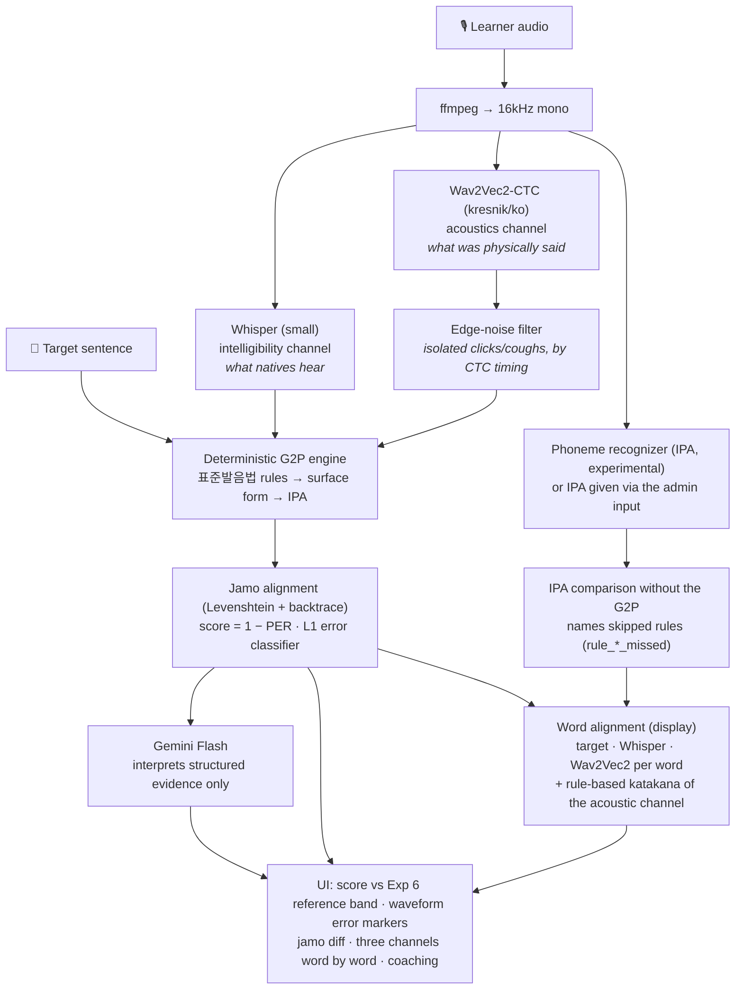
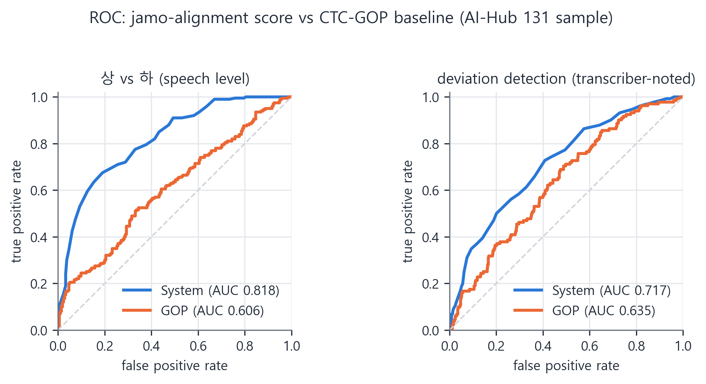
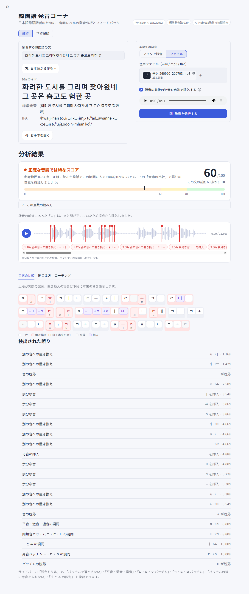
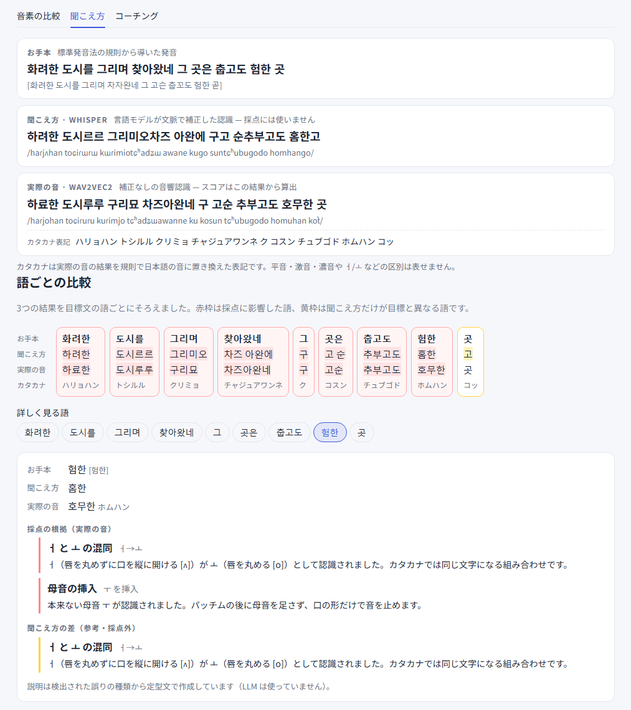
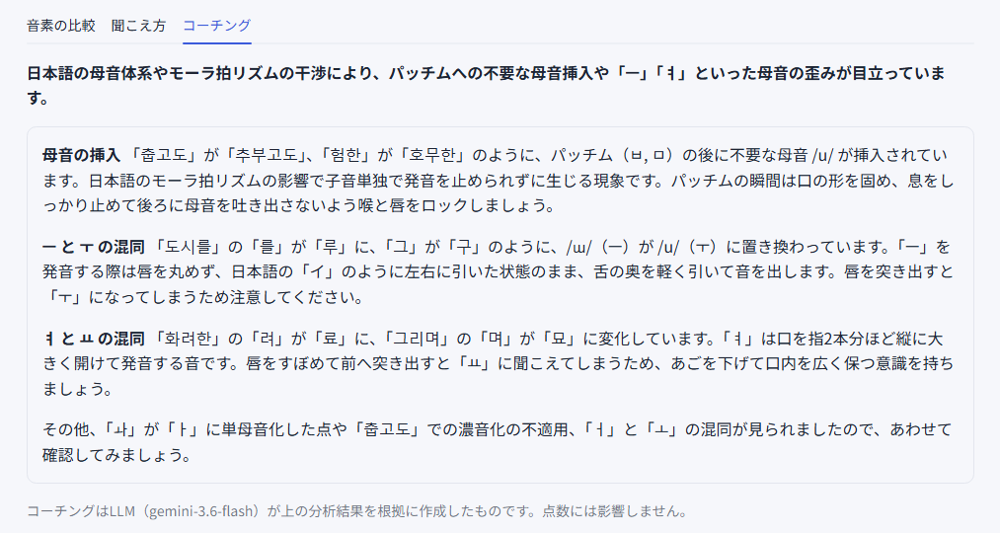

[🇰🇷 한국어 (Korean)](README_kr.md) | [🇯🇵 日本語 (Japanese)](README_jp.md)

# Phoneme-level Korean Pronunciation Coaching for Japanese Native Speakers 🧑‍🏫

[](https://github.com/fairyofdata/PhonemeJP2KR/actions/workflows/ci.yml)

[](https://youtu.be/4SwwmzEcpZQ)

> A CAPT (Computer-Assisted Pronunciation Training) web application for Japanese learners of Korean. It combines a **dual-ASR perception/production probe** (Whisper × Wav2Vec2), a **deterministic Korean G2P phonological rule engine**, and an **LLM interpretation layer** (Gemini) to detect, quantify, and explain pronunciation errors at the phoneme (jamo) level — with L1 interference made visible through katakana back-mapping.

---

## Table of Contents
1. [Problem Statement](#problem-statement)
2. [Design Principle](#design-principle)
3. [Architecture](#architecture)
4. [The Deterministic G2P Engine](#the-deterministic-g2p-engine)
5. [Scoring & L1 Error Taxonomy](#scoring--l1-error-taxonomy)
6. [Academic Background](#academic-background)
7. [Empirical Validation](#empirical-validation)
8. [Installation](#installation)
9. [Usage](#usage)
10. [Testing](#testing)
11. [Production & Operational Engineering](#production--operational-engineering)
12. [Limitations & Roadmap](#limitations--roadmap)

---

## Problem Statement

Adult Japanese learners of Korean face a systematic obstacle rooted in phonology, not effort:

- **Mora-timed L1 rhythm** — Japanese phonotactics strongly prefer open (CV) syllables, so learners unconsciously repair Korean coda consonants (받침) by inserting epenthetic vowels (*밥* /pap̚/ → *バプ* [bapɯ]).
- **A two-way laryngeal contrast mapped onto a three-way one** — Japanese distinguishes voiced/voiceless; Korean distinguishes lenis/aspirated/tense (ㄱ/ㅋ/ㄲ). Learners collapse the triad.
- **Phonological deafness** — learners literally cannot hear the difference between what they produced and what they intended, because L1 perceptual categories filter the acoustic signal before it reaches awareness.

Generic pronunciation apps score "correct/incorrect" at the word level. That does not help a learner who cannot perceive *why* they were wrong. This project targets the perception gap itself.

## Design Principle

**The LLM never computes measurements.** A common failure mode of LLM-based language tools is asking the model to "transcribe to IPA and grade the pronunciation" — the output looks plausible but is non-deterministic, unreproducible, and hallucination-prone.

This system enforces a strict separation:

| Layer | Component | Property |
|---|---|---|
| **Measurement** | Rule-based G2P (표준발음법) + jamo alignment | Deterministic, unit-tested, reproducible |
| **Perception probe** | Whisper (strong internal LM) vs Wav2Vec2-CTC (no LM) | The *gap* between the two separates intelligibility from acoustics |
| **Phone channel** | Multilingual phoneme recognizer (IPA) or given IPA, compared without the G2P | Names skipped phonological rules the Hangul channels cannot see — experimental |
| **Interpretation** | Gemini Flash (newest model that answers, from a fallback list), fed structured evidence (error tags, IPA, score) | Used only for pedagogy: coaching text |

The same audio always yields the same score. If the LLM is unavailable, the full quantitative analysis still renders.

## Architecture


```mermaid
flowchart TD
    A[🎙️ Learner audio] --> B[ffmpeg → 16kHz mono]
    B --> C["Whisper (small)<br/>intelligibility channel<br/><i>what natives hear</i>"]
    B --> D["Wav2Vec2-CTC (kresnik/ko)<br/>acoustics channel<br/><i>what was physically said</i>"]
    T[🎯 Target sentence] --> G
    C --> G["Deterministic G2P engine<br/>표준발음법 rules → surface form → IPA"]
    D --> N["Edge-noise filter<br/><i>isolated clicks/coughs, by CTC timing</i>"]
    N --> G
    G --> S["Jamo alignment (Levenshtein + backtrace)<br/>score = 1 − PER · L1 error classifier"]
    S --> W["Word alignment (display)<br/>target · Whisper · Wav2Vec2 per word<br/>+ rule-based katakana of the acoustic channel"]
    B --> P["Phoneme recognizer (IPA, experimental)<br/>or IPA given via the admin input"]
    P --> I["IPA comparison without the G2P<br/>names skipped rules (rule_*_missed)"]
    I --> W
    S --> L["Gemini Flash<br/>interprets structured evidence only"]
    L --> U["UI: score vs Exp 6 reference band · waveform error markers<br/>jamo diff · three channels word by word · coaching"]
    S --> U
    W --> U
```

**Why dual ASR?** Whisper carries a strong language model, so it auto-corrects mispronunciations the way a native listener's brain does — its output approximates *intelligibility*. Wav2Vec2 with greedy CTC decoding has no language model, so its output stays close to the raw phone sequence — *acoustics*. The divergence between the two channels is precisely the "I can't hear my own mistake" gap that L2 learners suffer from, made measurable.

**Three channels, one notation.** The result view shows three channels — the target (standard pronunciation), what Whisper heard, and what Wav2Vec2 recognised (the score's basis). Katakana is not a fourth channel: it is the acoustic channel written in Japanese sounds by a fixed rule table ([`src/kana.py`](src/kana.py)), shown to make visible what it *loses* — lenis/aspirated/tense onsets, ㅓ/ㅗ, ㅡ/ㅜ and ㄴ/ㅇ codas all collapse, which is exactly why the learner cannot hear them. The target and Whisper lines get no katakana. Because Wav2Vec2 output has no spaces, the word view cuts it into the target's words through the scorer's own jamo alignment ([`src/words.py`](src/words.py)); each word's tags are the scored tags, and its Japanese explanation is a fixed template per tag, not LLM text. See decision 11 in [`docs/DECISIONS.md`](docs/DECISIONS.md). Every channel is also shown in IPA, word by word, with the differing phones in red — [ʌ]→[o] next to ㅓ→ㅗ. A fourth, experimental channel compares *phones* without the G2P ([`src/ipa.py`](src/ipa.py)): an IPA string from a multilingual phoneme recognizer, or one given through the admin input, is aligned with the target's surface IPA, and where the learner produced the letter-by-letter phone instead of a rule's output the tag names the skipped rule — tensification, nasalization, lateralization, aspiration, palatalization or liaison. That is the one error class the Hangul channels cannot see, because their hypothesis is re-derived by the same G2P (decision 13).

## The Deterministic G2P Engine

[`src/g2p.py`](src/g2p.py) implements the major phonological rules of Standard Korean (표준발음법) as a pure-Python pipeline over decomposed jamo, with no external dependencies:

| Rule | 표준발음법 | Example |
|---|---|---|
| ㅎ-aspiration / deletion | §12 | 좋다 → [조타], 좋아 → [조아], 입학 → [이팍] |
| Palatalization (구개음화) | §17 | 같이 → [가치], 굳이 → [구지] |
| Liaison (연음) | §13–14 | 한국어 → [한구거], 없어요 → [업써요] |
| Coda neutralization (7종성) | §8–11 | 부엌 → [부억], 있다 → [읻따] |
| Post-obstruent tensification | §23 | 학교 → [학꾜], 국밥 → [국빱] |
| Nasal / liquid assimilation | §18–20 | 합니다 → [함니다], 신라 → [실라], 독립 → [동닙] |
| Vowel realization (ㅢ, 져/쪄/쳐) | §5 | 희망 → [히망], 회의 → [회이], 가져 → [가저] |

Rules that depend on *morpheme boundaries* — invisible to a context-free engine — are handled by a separate layer, [`src/morphology.py`](src/morphology.py), which uses the Kiwipiepy POS tagger (version-pinned for determinism) to rewrite the orthography into a pronunciation spelling before the pipeline runs. The copula/ending distinction matters: naive boundary detection turns 학생입니다 into \*[학쌩님니다]; this layer keeps it [학쌩임니다].

| Morphology-conditioned rule | 표준발음법 | Example |
|---|---|---|
| ㄴ-insertion at compound boundaries | §29 | 꽃잎 → [꼰닙], 한여름 → [한녀름] |
| Verb-stem tensification | §24–25 | 신다 → [신따], 넓게 → [널께] |
| Stem coda choices | §10–11 단서 | 밟다 → [밥따], 읽고 → [일꼬] |
| Liaison blocking before lexical morphemes | §15 | 맛없다 → [마덥따] (§15 다만: 맛있다 → [마싣따]) |
| ㄴ+ㄹ → [ㄴㄴ] in Sino-Korean derivation | §20 다만 | 의견란 → [의견난] (vs 신라 → [실라]) |

Without Kiwipiepy installed the engine degrades gracefully to the context-free pipeline. The surface form is then mapped to IPA with basic allophony (intervocalic lenis voicing /k/→[ɡ], ㅅ-palatalization [s]→[ɕ] before front glides): `만나서 반갑습니다` → `/mannasʌ panɡap̚s͈ɯmnida/`.

Because **both** the target and the ASR hypothesis pass through the same G2P, orthographic variance is neutralized — e.g. *감사합니다* and its surface spelling *감사함니다* score identically (100), as they should.


**Across word boundaries.** Read as one phrase, the rules run over the gap too — 밥 먹어 → [밤머거] (§18 붙임), 옷 입어 → [온니버] (§29 붙임2), 밭 아래 → [바다래] (§15) — while a reader who pauses says [밥 머거]. Both are standard, so the target is built in both readings and each boundary is judged on its own: the reading with fewer errors *at that boundary* is the one scored there, ties keep the pausing reading, and the choice is recorded (`ScoreReport.linked`, `linked_boundaries` in the export) and drawn as ‿ in the word view. Deciding per boundary rather than per sentence keeps errors elsewhere from choosing the reading. Not covered: prosody — where the speaker actually paused is inferred from the phones, not measured, and §29's lexical exceptions (곧이어 → [고디어]) are not listed.
## Scoring & L1 Error Taxonomy

[`src/scoring.py`](src/scoring.py) aligns the two jamo sequences with Levenshtein dynamic programming (full backtrace) and computes **score = round(100 × (1 − PER))**. The alignment trace drives:

1. a per-phoneme diff table in the UI, and
2. a rule-based classifier tagging known Japanese-L1 interference patterns:

| Tag | Linguistic phenomenon | Example |
|---|---|---|
| `vowel_epenthesis` | Mora-timed CV repair after codas | 밥 → 바브 |
| `coda_deletion` | 받침 dropped entirely | 밥 → 바 |
| `laryngeal_confusion` | lenis/aspirated/tense collapse | 딸 → 달 |
| `vowel_ʌ_o_confusion` | ㅓ/ㅗ merger (no /ʌ/ in JP) | 서울 → 소울 |
| `vowel_ɯ_u_confusion` | ㅡ/ㅜ merger (no /ɯ/ in JP) | 그 → 구 |
| `vowel_jʌ_jo_confusion` | the ʌ/o merger carried onto the j-glide | 여기 → 요기 |
| `diphthong_ɰi_monophthongization` | word-initial ㅢ flattened (no ɰ-glide in JP) | 의사 → 이사 |
| `nasal_coda_confusion` | ㄴ/ㅁ/ㅇ codas collapse into JP moraic ん | 산 → 상, 감 → 간 |
| `stop_coda_confusion` | unreleased ㄱ/ㄷ/ㅂ codas lose place (JP 促音 っ has none) | 밥 → 박 |

Coda tags are position-aware: an onset ㄴ/ㅁ or ㄱ/ㄷ/ㅂ swap is not tagged as a coda error. The taxonomy covers 8 of the 11 frequent-error categories that Lee (2022) compiles for Japanese learners; the other three (voicing, phonological-rule application, intonation) are structurally invisible to text-output ASR — see the coverage audit in [`docs/L1_TAXONOMY.md`](docs/L1_TAXONOMY.md). In the app, each tag has a matching drill set, and the history tab aggregates tags into a per-learner weak-point profile that recommends the next drill.

These structured tags — not raw strings — are what the LLM receives, so its feedback cites concrete evidence instead of guessing.

**How the app presents the score.** Experiment 6 found the score ordinally valid but not calibrated: even jamo-faithful readings average 79.6. The app therefore leads with where the score falls among faithful readings — ≥ median (81): *as high as a typical faithful reading*; p10–median (68–80): *indeterminate, ASR noise and error overlap*; < p10: *rare for a faithful reading* (deliberately not labelled "error" — Exp 6 deviation-detection AUC is 0.717) — followed by the raw score and its change since the previous attempt at the same sentence, the use Exp 1 and Exp 4 support most directly. Cut points are read from `experiments/results/exp6_l2_validation.json` ([`src/reference.py`](src/reference.py)), so re-running Exp 6 after fine-tuning moves them automatically.

## Academic Background

The rule-based L1 classifier is grounded in contrastive-phonology studies of Japanese learners of Korean; each error tag in `src/scoring.py` corresponds to an empirically documented phenomenon:

- **Vowel epenthesis & open resyllabification (`vowel_epenthesis`, `coda_deletion`)**: Japanese learners map Korean codas onto the moraic templates /Q/ (促音) and /N/ (撥音), repairing CVC into CV.CV; longitudinal spontaneous-speech data confirms open syllabification and final-consonant deletion as persistent error classes.
  - 🔗 [중국어와 일본어 모어 화자의 한국어 음절 종성 산출 차이 연구 (장향실, 우리어문연구, 2016)](https://www.dbpia.co.kr/journal/articleDetail?nodeId=NODE10761462)
  - 🔗 [음절 연쇄에서 나타나는 일본인 학습자의 한국어 종성 발음 유형 (하호빈·이화진, 언어사실과 관점, 2019)](https://www.dbpia.co.kr/journal/articleDetail?nodeId=NODE09235049)
  - 🔗 [일본인 학습자의 한국어 발음 오류에 대한 종적 연구 (이화진, 2021)](https://www.kci.go.kr/kciportal/ci/sereArticleSearch/ciSereArtiView.kci?sereArticleSearchBean.artiId=ART002730504)
- **Mora-timed rhythm transfer**: acoustic metrics (%V, VarcoV, VarcoS) show that even advanced Japanese learners produce Korean with mora-timed rhythm, deviating most in closed syllables with nasal codas — precisely the environments the jamo alignment flags.
  - 🔗 [Native language interference in producing the Korean rhythmic structure: Focusing on Japanese (Phonetics and Speech Sciences 10(4))](https://www.eksss.org/archive/view_article?pid=pss-10-4-45)
- **Nasal over-assimilation (`nasal_coda_confusion`)**: when nasalization is required, Japanese learners redundantly copy the place of articulation from the following consonant (redundant place assimilation).
  - 🔗 [한국어 비음화의 오류 유형과 원인 분석 (이화진, 언어사실과 관점, 2018)](https://www.dbpia.co.kr/journal/articleDetail?nodeId=NODE08838909)
- **Vowel-inventory mergers (`vowel_ʌ_o_confusion`, `vowel_ɯ_u_confusion`)**: the absence of /ʌ/ and /ɯ/ in the Japanese vowel system causes systematic mergers.
  - 🔗 [모음 체계와 자질에 의한 일본인 학습자의 한국어 모음 발음 분석 (KCI)](https://www.kci.go.kr/kciportal/ci/sereArticleSearch/ciSereArtiView.kci?sereArticleSearchBean.artiId=ART002158469)
- **Text-level similarity as an intelligibility proxy**: recent work shows that scoring L2 Korean speech by morpheme-level similarity between the reference and the ASR transcript tracks native listeners' comprehension better than off-the-shelf pronunciation-scoring APIs — independent support for this project's choice to score jamo-level similarity over ASR output rather than trust a single black-box score.
  - 🔗 [형태소 분석기반 외국인 발화 한국어 발음평가 개선 방법 (DBpia)](https://www.dbpia.co.kr/journal/articleDetail?nodeId=NODE11438586)

- **Curriculum & taxonomy coverage**: Lee (2022) derives eleven frequent error categories for Japanese learners from the contrastive literature and designs an ASR-based mobile app around them, but leaves implementation and evaluation open. This project implements the detectable subset and audits the rest; corpus evidence on the same AI-Hub L2 data (Yeo et al., 2023: /ɯ/ insertion specific to Japanese L1; diphthong monophthongization and plain-for-aspirated/tense substitution common across L1s) grounds `vowel_epenthesis`, `diphthong_ɰi_monophthongization`, and `laryngeal_confusion`.
  - 🔗 [일본인 학습자를 위한 한국어 발음 학습용 모바일 애플리케이션 설계 연구 (이유나, 경기대학교 석사학위논문, 2022)](https://www.dbpia.co.kr/journal/detail?nodeId=T16143963)
  - 🔗 [Comparison of L2 Korean pronunciation error patterns from five L1 backgrounds by using automatic phonetic transcription (Yeo et al., ICPhS 2023)](https://arxiv.org/abs/2306.10821)

For the full bibliography with abstracts, see [`docs/REFERENCES.md`](docs/REFERENCES.md); the design choices behind the pipeline, with the evidence for each, are recorded in [`docs/DECISIONS.md`](docs/DECISIONS.md).

## Empirical Validation

Six reproducible experiments ([`experiments/`](experiments/), full report in [docs/EVALUATION.md](docs/EVALUATION.md)):

| # | Question | Result |
|---|---|---|
| 1 | Is LLM-generated IPA a valid scorer? | **No** — on identical input, the v1 LLM scorer fluctuated 89–93 (sd 1.45) across 10 runs, producing 4 different IPA transcriptions of the same word. The deterministic scorer: sd 0.0. |
| 2 | Does the pipeline detect injected L1 errors? (TTS perturbation study) | **80% pairwise ranking accuracy** over 10 sentence pairs; mean gap 10.3 points. Both failures trace to the documented ASR-error confound and are analyzed in the report. |
| 3 | Does the G2P engine generalize beyond its dev examples? | **100% (51/51)** on held-out context-free rules and **100% (17/17)** on morphology-conditioned items; 0/5 on semantics-dependent 사잇소리 items, matching the documented scope. Runs in CI as a regression gate. |
| 4 | Does the score track error *severity*? (graded 0–3 injection) | **Spearman ρ = −0.702** [95% CI −0.928, −0.325]; mean score strictly decreasing by severity (91.8→74.8), 87% monotonic steps. |
| 6 | Does the score carry signal on **real Japanese-accented speech**? (615 clips, 198 speakers, AI-Hub L2 corpus) | **Yes, ordinally** — AUC 0.818 separating 상/하 speech-level ratings, ρ = 0.473 vs human ratings; detects transcriber-noted reading deviations at AUC 0.717. Also measures the ASR noise floor (mean 79.6 on faithful readings): absolute scores are not calibrated until the acoustic model is accent-tuned. |
| 6b | Does it beat the classic **GOP baseline** (Witt & Young, 2000)? | **Yes, on every axis** — same 615 clips, same acoustic model, CTC likelihood-ratio GOP: 상/하 AUC 0.818 vs 0.606, ρ vs human ratings 0.473 vs 0.153, deviation detection 0.717 vs 0.635. Independent real-data support for scoring text-level similarity over raw model confidences. |



The recruited-rater correlation study with pronunciation-specific ratings (Experiment 5) remains designed and harness-ready (protocol: [docs/HUMAN_EVAL_PROTOCOL.md](docs/HUMAN_EVAL_PROTOCOL.md), analysis script: [`experiments/exp5_human_correlation.py`](experiments/exp5_human_correlation.py)); Experiment 6 covers its scale axis with corpus labels, Experiment 5 will cover its precision axis with anchored 1–5 pronunciation ratings.

## Installation

**Windows, in one step:** clone the repository and double-click `run_app.bat`. It creates `.venv`, installs the requirements on the first run (about 2 GB, torch included), and starts the app; later runs start in seconds. `run_app.bat --update` reinstalls the requirements after a `git pull`.

Manual setup, or on macOS / Linux:

```bash
git clone https://github.com/fairyofdata/PhonemeJP2KR
cd PhonemeJP2KR
python -m venv .venv && .venv/Scripts/activate   # or: source .venv/bin/activate
pip install -r requirements.txt
```

Set your Gemini API key (free tier from [Google AI Studio](https://aistudio.google.com/)) as an environment variable:

```bash
# Windows (PowerShell)
$env:GEMINI_API_KEY = "your-key"
# macOS / Linux
export GEMINI_API_KEY="your-key"
```

Alternatively put `GEMINI_API_KEY=your-key` in a `.env` file at the project root (gitignored), or `GEMINI_API_KEY = "your-key"` in `.streamlit/secrets.toml`. Resolution order: environment variable → `.env` → Streamlit secrets. Without a key, scoring and the phoneme analysis still work; only the coaching text and JP→KR translation are unavailable.

## Usage

```bash
streamlit run app.py
```

1. Pick a sentence: type Korean, generate it from Japanese (「日本語から作る」), or choose a weak-point drill in the sidebar. Its standard surface pronunciation and IPA are shown immediately.
2. Listen to the native reference (edge-tts neural voices: SunHi / InJoon / Hyunsu, chosen in the sidebar).
3. Record with the browser mic or upload a file, then run the analysis.
4. Read the result: the reference band and score with the change since your last attempt at the same sentence; a waveform player whose red markers (Wav2Vec2-CTC timestamps) replay each detected error; then tabs for the syllable-grouped jamo diff with named errors, the three channels aligned word by word (pick a flagged word to see its three readings, its katakana and a Japanese explanation of each tag), and the LLM coaching.
5. The 学習記録 tab charts your scores, aggregates recurring errors into a weak-point profile, and reopens any past attempt in the result view — with its recording, kept for the 50 most recent attempts.

A Japanese voice reading *화려한 도시를 그리며 찾아왔네 그 곳은 춥고도 험한 곳* the way Japanese learners typically do — the Nanami TTS voice speaks a kana script (はりょはん どしるる ぐりみょ ちゃずあわっね …), fed in through the admin text input together with the Hangul and IPA transcripts of that reading. The sentence has 22 syllables carrying liaison and nasalisation (찾아왔네 → [차자완네]), tensification (춥고도 → [춥꼬도]) and coda neutralisation (곳 → [곧]).



*The score sits in the Experiment 6 reference band, the red markers replay each detected error from its CTC timestamp, and the syllable-grouped jamo diff names every mismatch.*



*The same take in four rows — the target, what Whisper heard, the acoustic reading the score is computed from (katakana beneath) and the IPA channel — then word by word in Hangul and IPA, differing phones in red. The selected word shows why the IPA channel exists: the reading 차즈아왔네 is re-derived by the G2P into [차즈아완네], so the Hangul channel sees only the inserted vowel; compared as phones, [tɕʰadʑɯawat̚ne] also shows that nasalization was skipped ([n]→[t]). Elsewhere the take carries the textbook Japanese-L1 set (ㅡ→ㅜ, ㅕ→ㅛ, a vowel after the coda, ㅓ→ㅗ), and in five flagged words the katakana of target and reading are identical.*

This take is also exported as data — [`docs/assets/demo_take.json`](docs/assets/demo_take.json), schema in [`docs/DEMO_TAKE.md`](docs/DEMO_TAKE.md) — generated from the stored record by `tools/export_demo_take.py` with no model or API call, and checked against it.



*The LLM only interprets that evidence — it names the error in Japanese and says what to do with the mouth, and never recomputes the score.*

## Testing

The linguistic core is fully unit-tested (192 tests): 60+ surface-form conversions verified against Standard Korean pronunciation — including morphology-conditioned rules and regression guards for boundary false-positives — plus IPA mapping, alignment ops, CTC timestamp threading, statistics helpers, and every L1 error tag. Around the core: the reference bands read from the Exp 6 results, API-key resolution (env var → `.env` → secrets), history persistence with clip pruning, edge-noise rules (including the cases that must *not* be stripped), CTC forced alignment for the admin input, the IPA channel (all six skipped-rule tags, notation normalization, display allophony), the word-level alignment of the unspaced acoustic output and the katakana table (including the contrasts it must merge), and the UI markup — syllable grouping and escaping of learner/ASR/LLM text.

```bash
pip install -r requirements-dev.txt
python -m pytest tests/ -q
```

## Production & Operational Engineering

Designed with practical engineering constraints for low latency, fault tolerance, and predictable operating costs:

- **Graceful Degradation & Fault Tolerance**: The measurement layer (deterministic G2P, CTC alignment, scoring) is strictly decoupled from the LLM. If the external Gemini API encounters rate limits or network outages, the core quantitative analysis and phoneme error diff remain 100% functional.
- **Inference Latency & Memory Management**: ASR models (Whisper & Wav2Vec2) are cached as in-memory singletons (`@st.cache_resource`) to eliminate redundant cold-starts. Audio preprocessing utilizes an optimized `ffmpeg` pipeline with immediate ephemeral file unlinking, preventing disk I/O bloat and memory leaks.
- **Token Cost Optimization**: Raw audio waveforms are processed locally by acoustic models rather than streamed to costly multimodal LLM APIs. Only concise, structured diagnostic evidence (`error_tags`, IPA, score) is passed to Gemini Flash (`temperature=0.2`), keeping payload under ~350 tokens.

## Limitations & Roadmap

Known limitations of the rule engine (documented in [`src/g2p.py`](src/g2p.py)):
- 사잇소리 tensification in native compounds (강가 → [강까], 밤길 → [밤낄]) — requires semantic compound analysis, beyond POS tagging
- Morphology-conditioned rules depend on Kiwipiepy's POS disambiguation; genuinely ambiguous eojeols (e.g. bare 신고: noun [신고] vs verb [신꼬]) resolve to Kiwi's most probable reading

Recorder noise (a button click, a throat clear) is transcribed by the LM-free acoustics channel and would score as an insertion. [`src/preprocess.py`](src/preprocess.py) drops such a chunk only when it sits at the edge of the take, is separated by a pause (CTC character offsets), and removing it raises the score — so an epenthetic vowel, which is continuous with the speech, is never removed. Noise that overlaps the speech itself is not separable this way.

Known limits of the error taxonomy ([`docs/L1_TAXONOMY.md`](docs/L1_TAXONOMY.md)): voicing, phonological-rule application (e.g. saying [합니다] without nasalization), and question intonation cannot be detected, because the acoustic channel emits spelling, which the G2P re-normalizes.

Planned:
- **Experiment 7 — which error categories track proficiency** ([`experiments/exp7_error_profile.py`](experiments/exp7_error_profile.py)): per-tag rates by 상/중/하 on the Experiment 6 sample, with a noise baseline; script ready, run pending on the data machine
- **Intonation channel** — final-syllable F0 contour (rise for yes/no, fall for wh-questions), independent of ASR
- **K-drama shadowing mode** — preset target sentences from popular content
- **Fine-tuning Wav2Vec2 on Japanese-accented L2 Korean speech** — the [AI-Hub 외국인 한국어 발화 음성 데이터](https://aihub.or.kr/aihubdata/data/view.do?currMenu=115&topMenu=100&aihubDataSe=realm&dataSetSn=505) Japanese-L1 training split (131k read-aloud utterances, 255 speakers, 607 h) is acquired locally; Experiment 6 quantified the ASR-error confound this will attack (noise floor 79.6 on faithful readings). Note: the corpus labels are orthographic, so this lowers noise but will not expose rule-application errors — that needs pronunciation-faithful (phone-level) labels

## License

MIT License.
