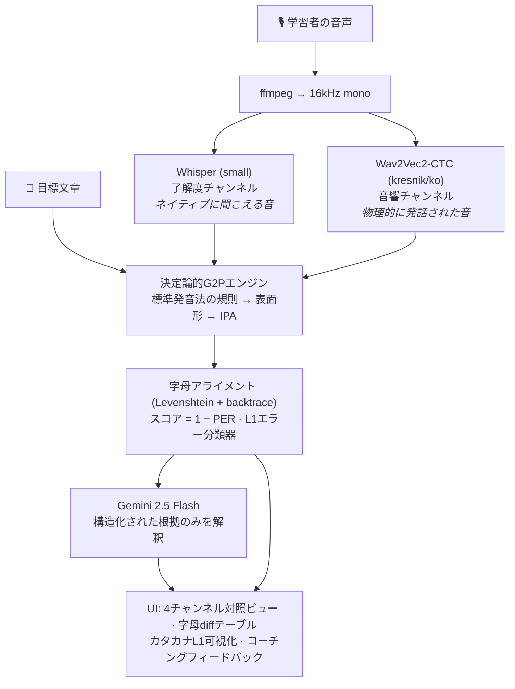

[🇺🇸 English](README.md) | [🇰🇷 한국어 (Korean)](README_kr.md)

# 日本語母語話者のための音素レベル韓国語発音コーチング 🧑‍🏫

[](https://youtu.be/4SwwmzEcpZQ)

> 日本人韓国語学習者向けのCAPT（コンピュータ支援発音訓練）Webアプリケーションです。**デュアルASRによる知覚/産出プローブ**（Whisper × Wav2Vec2）、**決定論的な韓国語G2P音韻規則エンジン**、**LLM解釈レイヤー**（Gemini）を組み合わせ、字母（音素）レベルで発音エラーを検出・定量化・説明します。母語干渉（L1 Interference）はカタカナへの逆マッピングによって可視化されます。

---

## 問題意識

成人の日本人学習者が直面する韓国語発音の壁は、努力ではなく音韻論に根ざした体系的なものです。

- **モーラ拍リズム** — 日本語の音素配列は開音節（CV）を強く好むため、学習者は韓国語のパッチム（終声）の後に無意識に母音を挿入して音節を「修復」します（*밥* /pap̚/ → *バプ* [bapɯ]）。
- **二項対立を三項対立に写像** — 日本語は有声/無声のみを区別しますが、韓国語は平音/激音/濃音（ㄱ/ㅋ/ㄲ）を区別します。学習者はこの三項対立を潰してしまいます。
- **音韻論的難聴 (Phonological Deafness)** — 母語の知覚カテゴリーが音響信号を意識に届く前にフィルタリングするため、学習者は自分が出した音と意図した音の違いを文字通り「聞くことができません」。

単語単位の正誤判定しか返さない一般的な発音アプリは、「なぜ間違ったのか」を知覚できない学習者の助けになりません。本プロジェクトはその知覚ギャップ自体を標的にします。

## 設計原則

**LLMに測定をさせない。** LLMベースの語学ツールにありがちな失敗は、モデルに「IPAに転写して発音を採点して」と頼むことです — 出力はもっともらしく見えますが、非決定的で再現不可能、かつハルシネーションの温床です。

本システムは以下の厳格な分離を強制します:

| レイヤー | コンポーネント | 性質 |
|---|---|---|
| **測定** | 規則ベースG2P（標準発音法）+ 字母アライメント | 決定論的・ユニットテスト済み・再現可能 |
| **知覚プローブ** | Whisper（強力な内部LM）vs Wav2Vec2-CTC（LMなし） | 両者の*差分*が了解度と音響を分離 |
| **解釈** | Gemini 2.5 Flash — 構造化された根拠（エラータグ・IPA・スコア）を入力 | 教育的役割のみ: カタカナ表記 + コーチング文 |

同じ音声は常に同じスコアを返します。LLMが利用できない場合でも、定量分析はすべて表示されます。

## アーキテクチャ



**なぜデュアルASRなのか？** Whisperは強力な言語モデルを内蔵しており、ネイティブ聴者の脳がするように発音エラーを文脈で自動補正します — 出力は*了解度 (intelligibility)*を近似します。一方、greedy CTCデコーディングのWav2Vec2には言語モデルがなく、出力は実際に発話された音素列に近い — *音響 (acoustics)*。この2チャンネルの乖離こそ、L2学習者が苦しむ「自分のミスが自分では聞こえない」ギャップを測定可能にしたものです。

## 決定論的G2Pエンジン

[`src/g2p.py`](src/g2p.py)は韓国語標準発音法の主要な音韻規則を、外部依存のない純Pythonパイプラインとして実装しています:

| 規則 | 標準発音法 | 例 |
|---|---|---|
| ㅎ激音化 / 脱落 | 第12項 | 좋다 → [조타], 좋아 → [조아], 입학 → [이팍] |
| 口蓋音化 | 第17項 | 같이 → [가치], 굳이 → [구지] |
| 連音 | 第13–14項 | 한국어 → [한구거], 없어요 → [업써요] |
| 終声の中和（7終声） | 第8–11項 | 부엌 → [부억], 있다 → [읻따] |
| 濃音化 | 第23項 | 학교 → [학꾜], 국밥 → [국빱] |
| 鼻音化 / 流音化 | 第18–20項 | 합니다 → [함니다], 신라 → [실라], 독립 → [동닙] |

表面形は基本的な異音規則（母音間の平音有声化 /k/→[ɡ]、前舌渡り音の前のㅅ口蓋化 [s]→[ɕ]）とともにIPAへ変換されます: `만나서 반갑습니다` → `/mannasʌ panɡap̚s͈ɯmnida/`。

目標文章とASR仮説の**両方**が同じG2Pを通過するため、表記のゆれは中和されます — 例: *감사합니다*とその表面表記*감사함니다*は同一の100点になります。

## スコアリングとL1エラー分類体系

[`src/scoring.py`](src/scoring.py)は2つの字母列をLevenshtein DP（バックトレース付き）でアライメントし、**スコア = round(100 × (1 − PER))** を計算します。アライメント結果は次の2つに供給されます:

1. UIの音素単位diffテーブル
2. 日本語母語干渉パターンをタグ付けする規則ベース分類器:

| タグ | 言語学的現象 | 例 |
|---|---|---|
| `vowel_epenthesis` | パッチム後のモーラ拍式CV修復 | 밥 → 바브 |
| `coda_deletion` | パッチムの脱落 | 밥 → 바 |
| `laryngeal_confusion` | 平音/激音/濃音の崩壊 | 딸 → 달 |
| `vowel_ʌ_o_confusion` | ㅓ/ㅗの合流（日本語に/ʌ/がない） | 서울 → 소울 |
| `vowel_ɯ_u_confusion` | ㅡ/ㅜの合流（日本語に/ɯ/がない） | 그 → 구 |
| `nasal_coda_confusion` | ㄴ/ㅇが日本語の撥音「ん」に統合 | 산 → 상 |

LLMは生の文字列ではなくこの構造化タグを受け取るため、推測ではなく具体的な根拠を引用したフィードバックを生成します。

## インストール

```bash
git clone https://github.com/fairyofdata/PhonemeJP2KR
cd PhonemeJP2KR
python -m venv .venv && .venv/Scripts/activate   # または source .venv/bin/activate
pip install -r requirements.txt
```

Gemini APIキー（[Google AI Studio](https://aistudio.google.com/)で無料発行）を環境変数に設定してください:

```bash
# Windows (PowerShell)
$env:GEMINI_API_KEY = "your-key"
# macOS / Linux
export GEMINI_API_KEY="your-key"
```

または `.streamlit/secrets.toml` に `GEMINI_API_KEY = "your-key"` を追加しても構いません。

## 使い方

```bash
streamlit run app.py
```

1. （任意）日本語の文を入力 → 自然な話し言葉の韓国語に自動翻訳
2. 目標文章を確認 — 標準表面発音とIPAが即座に表示されます
3. ネイティブのお手本音声を聞く（edge-ttsニューラルボイス: SunHi / InJoon / Hyunsu）
4. ブラウザのマイクで録音、またはファイルをアップロードして分析を実行
5. 4チャンネル対照ビュー、字母レベルdiff、日本語のコーチングフィードバックを確認


## テスト

言語学コアは完全にユニットテストされています（47件）: 標準発音法に基づく表面形変換30件以上、IPAマッピング、アライメント演算、すべてのL1エラータグを検証。

```bash
pip install -r requirements-dev.txt
python -m pytest tests/ -q
```

## 制約とロードマップ

規則エンジンの既知の制約（[`src/g2p.py`](src/g2p.py)に文書化）— いずれも形態素解析が必要な領域:
- 合成語のㄴ挿入（꽃잎 → [꼰닙]）
- 文脈依存の二重パッチム解消（밟다 → [밥따] vs 여덟 → [여덜]）
- 意味境界での連音例外（맛없다 → [마덥따]）

今後の計画:
- **強制アライメント** — CTC segmentationでエラーを時間軸上に特定し、該当区間を再生
- **韓国ドラマ・シャドーイングモード** — 人気コンテンツのセリフを目標文章プリセットとして提供
- **Wav2Vec2のファインチューニング** — 日本語アクセントの韓国語音声データによるアクセント認識型音響モデル
- 韓国語形態素解析器を用いた形態素認識型G2P

## ライセンス

MIT License.
