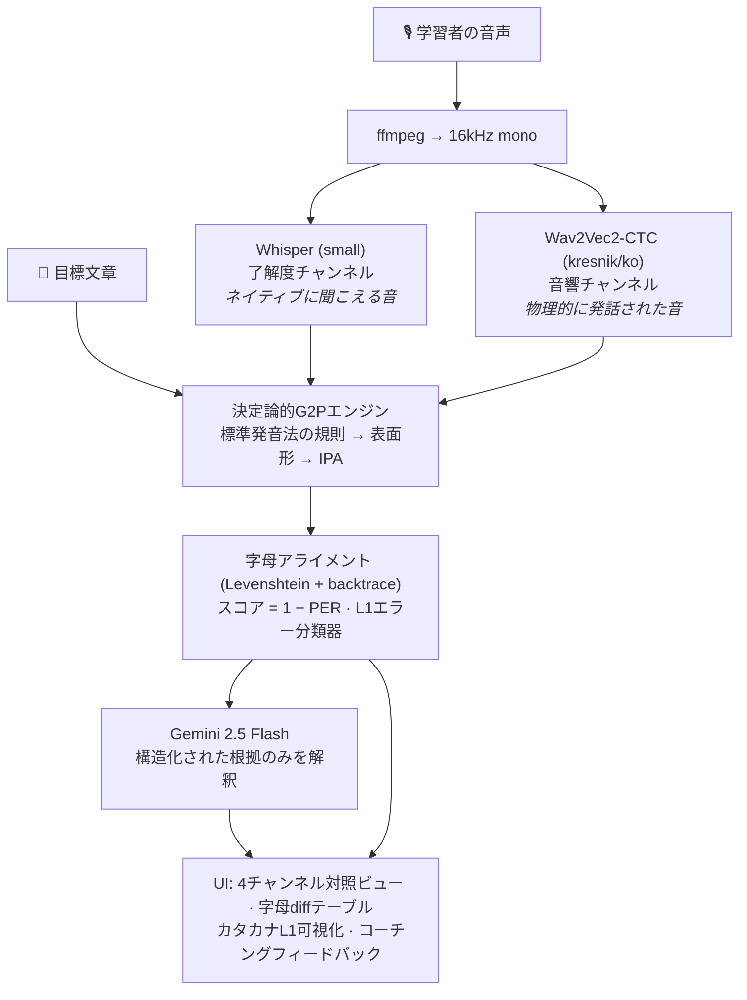
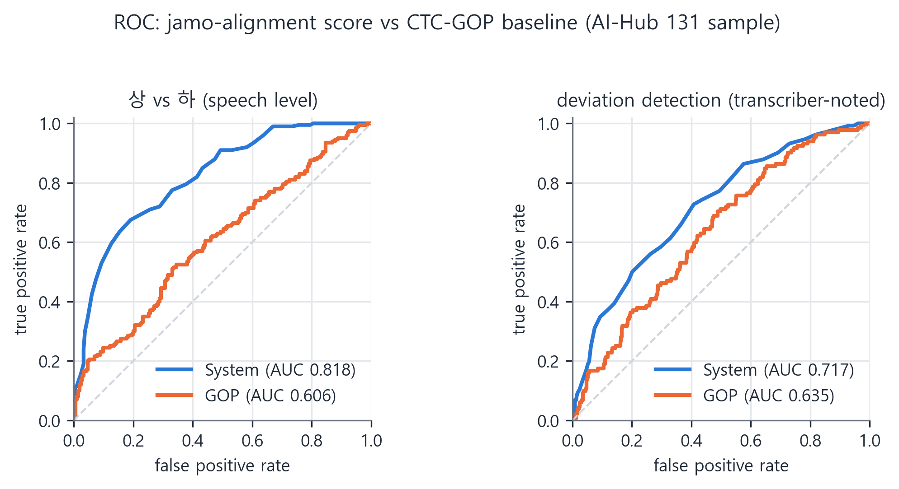

[🇺🇸 English](README.md) | [🇰🇷 한국어 (Korean)](README_kr.md)

# 日本語母語話者のための音素レベル韓国語発音コーチング 🧑‍🏫

[](https://github.com/fairyofdata/PhonemeJP2KR/actions/workflows/ci.yml)

[](https://youtu.be/4SwwmzEcpZQ)

> 日本人韓国語学習者向けのCAPT（コンピュータ支援発音訓練）Webアプリケーションです。**デュアルASRによる知覚/産出プローブ**（Whisper × Wav2Vec2）、**決定論的な韓国語G2P音韻規則エンジン**、**LLM解釈レイヤー**（Gemini）を組み合わせ、字母（音素）レベルで発音エラーを検出・定量化・説明します。母語干渉（L1 Interference）はカタカナへの逆マッピングによって可視化されます。

---

## 問題意識

成人の日本人学習者が直面する韓国語発音の壁は、努力ではなく音韻論に根ざした体系的なものです。

- **モーラ拍リズム** — 日本語の音素配列は開音節（CV）を強く好むため、学習者は韓国語のパッチム（終声）の後に無意識に母音を挿入して音節を「修復」します（*밥* /pap̚/ → *バプ* [bapɯ]）。
- **二項対立を三項対立に写像** — 日本語は有声/無声のみを区別しますが、韓国語は平音/激音/濃音（ㄱ/ㅋ/ㄲ）を区別します。学習者はこの三項対立を潰してしまいます。
- **音韻論的難聴 (Phonological Deafness)** — 母語の知覚カテゴリーが音響信号を意識に届く前にフィルタリングするため、学習者は自分が出した音と意図した音の違いを文字通り「聞くことができません」。

単語単位の正誤判定しか返さない一般的な発音アプリは、「なぜ間違ったのか」を知覚できない学習者の助けになりません。本プロジェクトはその知覚ギャップ自体を標的にします。

## 設計原則

**LLMに測定をさせない。** LLMベースの語学ツールにありがちな失敗は、モデルに「IPAに転写して発音を採点して」と頼むことです — 出力はもっともらしく見えますが、非決定的で再現不可能、かつハルシネーションの温床です。

本システムは以下の厳格な分離を強制します:

| レイヤー | コンポーネント | 性質 |
|---|---|---|
| **測定** | 規則ベースG2P（標準発音法）+ 字母アライメント | 決定論的・ユニットテスト済み・再現可能 |
| **知覚プローブ** | Whisper（強力な内部LM）vs Wav2Vec2-CTC（LMなし） | 両者の*差分*が了解度と音響を分離 |
| **解釈** | Gemini 2.5 Flash — 構造化された根拠（エラータグ・IPA・スコア）を入力 | 教育的役割のみ: カタカナ表記 + コーチング文 |

同じ音声は常に同じスコアを返します。LLMが利用できない場合でも、定量分析はすべて表示されます。

## アーキテクチャ



**なぜデュアルASRなのか？** Whisperは強力な言語モデルを内蔵しており、ネイティブ聴者の脳がするように発音エラーを文脈で自動補正します — 出力は*了解度 (intelligibility)*を近似します。一方、greedy CTCデコーディングのWav2Vec2には言語モデルがなく、出力は実際に発話された音素列に近い — *音響 (acoustics)*。この2チャンネルの乖離こそ、L2学習者が苦しむ「自分のミスが自分では聞こえない」ギャップを測定可能にしたものです。

## 決定論的G2Pエンジン

[`src/g2p.py`](src/g2p.py)は韓国語標準発音法の主要な音韻規則を、外部依存のない純Pythonパイプラインとして実装しています:

| 規則 | 標準発音法 | 例 |
|---|---|---|
| ㅎ激音化 / 脱落 | 第12項 | 좋다 → [조타], 좋아 → [조아], 입학 → [이팍] |
| 口蓋音化 | 第17項 | 같이 → [가치], 굳이 → [구지] |
| 連音 | 第13–14項 | 한국어 → [한구거], 없어요 → [업써요] |
| 終声の中和（7終声） | 第8–11項 | 부엌 → [부억], 있다 → [읻따] |
| 濃音化 | 第23項 | 학교 → [학꾜], 국밥 → [국빱] |
| 鼻音化 / 流音化 | 第18–20項 | 합니다 → [함니다], 신라 → [실라], 독립 → [동닙] |

文脈自由（context-free）エンジンには見えない*形態素境界*に依存する規則は、別レイヤーの[`src/morphology.py`](src/morphology.py)が担当します。Kiwipiepy品詞解析器（決定性確保のためバージョン固定）で境界を判定し、パイプライン実行前に表記を発音綴りに書き換えます。コピュラ/語尾の区別が肝心です — 境界を素朴に判定すると학생입니다が\*[학쌩님니다]になりますが、このレイヤーは[학쌩임니다]を維持します。

| 形態音韻規則 | 標準発音法 | 例 |
|---|---|---|
| 合成語境界のㄴ挿入 | 第29項 | 꽃잎 → [꼰닙], 한여름 → [한녀름] |
| 用言語幹末の濃音化 | 第24–25項 | 신다 → [신따], 넓게 → [널께] |
| 語幹の二重パッチム解消 | 第10–11項 但し書き | 밟다 → [밥따], 읽고 → [일꼬] |
| 実質形態素前の連音ブロック | 第15項 | 맛없다 → [마덥따]（第15項 但し書き: 맛있다 → [마싣따]） |
| 漢語のㄴ+ㄹ → [ㄴㄴ] | 第20項 但し書き | 의견란 → [의견난]（cf. 신라 → [실라]） |

Kiwipiepyが未インストールの環境では文脈自由パイプラインへ優雅に縮退します。表面形は基本的な異音規則（母音間の平音有声化 /k/→[ɡ]、前舌渡り音の前のㅅ口蓋化 [s]→[ɕ]）とともにIPAへ変換されます: `만나서 반갑습니다` → `/mannasʌ panɡap̚s͈ɯmnida/`。

目標文章とASR仮説の**両方**が同じG2Pを通過するため、表記のゆれは中和されます — 例: *감사합니다*とその表面表記*감사함니다*は同一の100点になります。

## スコアリングおよびL1エラー分類

[`src/scoring.py`](src/scoring.py)は2つの字母列をLevenshtein DP（バックトレース付き）でアライメントし、**スコア = round(100 × (1 − PER))** を計算します。アライメント結果は次の2つに供給されます:

1. UIの音素単位diffテーブル
2. 日本語母語干渉パターンをタグ付けする規則ベース分類器:

| タグ | 言語学的現象 | 例 |
|---|---|---|
| `vowel_epenthesis` | パッチム後のモーラ拍式CV修復 | 밥 → 바브 |
| `coda_deletion` | パッチムの脱落 | 밥 → 바 |
| `laryngeal_confusion` | 平音/激音/濃音の崩壊 | 딸 → 달 |
| `vowel_ʌ_o_confusion` | ㅓ/ㅗの合流（日本語に/ʌ/がない） | 서울 → 소울 |
| `vowel_ɯ_u_confusion` | ㅡ/ㅜの合流（日本語に/ɯ/がない） | 그 → 구 |
| `nasal_coda_confusion` | ㄴ/ㅇが日本語の撥音「ん」に統合 | 산 → 상 |

このように、LLMは生の文字列ではなく構造化されたタグを受け取るため、推測ではなく具体的な証拠に基づくフィードバックを生成します。

## 学術的背景

ルールベースのL1エラー分類器は、日本人韓国語学習者を対象とした対照音韻論研究に基づいています。`src/scoring.py`の各エラータグは、実証的に文書化された現象に対応します:

- **母音挿入と開音節化 (`vowel_epenthesis`, `coda_deletion`)**: 日本人学習者は韓国語の終声を日本語のモーラ単位である促音（/Q/）と撥音（/N/）に対応させ、CVCをCV.CVに修復します。縦断研究の自然発話データでも、開音節化と終声脱落が持続的なエラークラスとして確認されています。
  - 🔗 [중국어와 일본어 모어 화자의 한국어 음절 종성 산출 차이 연구（장향실, 우리어문연구, 2016）](https://www.dbpia.co.kr/journal/articleDetail?nodeId=NODE10761462)
  - 🔗 [음절 연쇄에서 나타나는 일본인 학습자의 한국어 종성 발음 유형（하호빈・이화진, 언어사실과 관점, 2019）](https://www.dbpia.co.kr/journal/articleDetail?nodeId=NODE09235049)
  - 🔗 [일본인 학습자의 한국어 발음 오류에 대한 종적 연구（이화진, 2021）](https://www.kci.go.kr/kciportal/ci/sereArticleSearch/ciSereArtiView.kci?sereArticleSearchBean.artiId=ART002730504)
- **モーラ拍リズムの転移**: 音響指標（%V, VarcoV, VarcoS）の分析により、上級の日本人学習者でも韓国語をモーラ拍リズムで産出し、鼻音終声を持つ閉音節で偏差が最大になることが示されています — 字母アライメントがフラグを立てるまさにその環境です。
  - 🔗 [Native language interference in producing the Korean rhythmic structure: Focusing on Japanese（말소리와 음성과학 10(4)）](https://www.eksss.org/archive/view_article?pid=pss-10-4-45)
- **鼻音化の過剰同化 (`nasal_coda_confusion`)**: 鼻音化が要求される環境で、日本人学習者は後続子音の調音位置を冗長にコピーします（redundant place assimilation）。
  - 🔗 [한국어 비음화의 오류 유형과 원인 분석（이화진, 언어사실과 관점, 2018）](https://www.dbpia.co.kr/journal/articleDetail?nodeId=NODE08838909)
- **母音体系のマージ (`vowel_ʌ_o_confusion`, `vowel_ɯ_u_confusion`)**: 日本語の母音体系に/ʌ/と/ɯ/が存在しないために生じる体系的なマージです。
  - 🔗 [모음 체계와 자질에 의한 일본인 학습자의 한국어 모음 발음 분석（KCI）](https://www.kci.go.kr/kciportal/ci/sereArticleSearch/ciSereArtiView.kci?sereArticleSearchBean.artiId=ART002158469)
- **テキスト類似度＝了解度プロキシ**: 原文とASR転写の形態素レベル類似度でL2韓国語発話を採点すると、既製の発音評価APIよりもネイティブの聴取結果に近づくという研究があります — ASR出力に対する字母レベル類似度採点という本プロジェクトの選択を独立に裏付けます。
  - 🔗 [형태소 분석기반 외국인 발화 한국어 발음평가 개선 방법（DBpia）](https://www.dbpia.co.kr/journal/articleDetail?nodeId=NODE11438586)

詳細な参考文献と要約については、[`docs/REFERENCES.md`](docs/REFERENCES.md)をご覧ください。

## 実証的検証 (Empirical Validation)

再現可能な6つの実験を実施しました（[`experiments/`](experiments/)、詳細レポート: [docs/EVALUATION.md](docs/EVALUATION.md)）:

| # | 問い | 結果 |
|---|---|---|
| 1 | LLM生成IPAは有効な採点器か？ | **No** — 同一入力に対しv1のLLM採点器は10回の実行で89〜93点と変動（sd 1.45）、同じ単語のIPA転写が4種類に分裂。決定論的採点器はsd 0.0。 |
| 2 | パイプラインは注入されたL1エラーを検出するか？（TTS摂動実験） | 10文ペアで**ランキング精度80%**、平均スコア差10.3点。失敗2件はいずれも文書化済みのASRエラー交絡に起因し、レポートで分析。 |
| 3 | G2Pエンジンは開発例の外に一般化するか？ | held-outの文脈自由規則**100% (51/51)** + 形態音韻規則**100% (17/17)**；意味依存のサイシオリ項目は0/5で、文書化された適用範囲と一致。CIで回帰ゲートとして実行。 |
| 4 | スコアはエラーの*重症度*を追跡するか？（0〜3段階の段階的注入） | **Spearman ρ = −0.702** [95% CI −0.928, −0.325]；重症度別平均スコアは厳密に単調減少（91.8→74.8）、単調ステップ率87%。 |
| 6 | **実際の日本語母語話者の発話**でもスコアは信号を持つか？（AI-Hub L2コーパス615クリップ、話者198名） | **順序的に有効** — 発話レベル上/下の分離AUC 0.818、人間評定とρ = 0.473；転写者が聞き取った音読逸脱の検出AUC 0.717。忠実な音読におけるASRノイズフロア（平均79.6）も実測 — アクセント適応ファインチューニングまでは絶対スコアは較正されない。 |
| 6b | 古典的な**GOPベースライン**（Witt & Young, 2000）を上回るか？ | **全指標で優位** — 同一615クリップ・同一音響モデルのCTC尤度比GOPとの比較: 上/下AUC 0.818 vs 0.606、人間評定との相関 0.473 vs 0.153、逸脱検出 0.717 vs 0.635。「生のモデル信頼度ではなくテキストレベル類似度を採点する」という中核設計の実データによる裏付け。 |



発音特化評定（1〜5点）による精密検証（実験5）は、設計と分析ハーネスが完備済みです（プロトコル: [docs/HUMAN_EVAL_PROTOCOL.md](docs/HUMAN_EVAL_PROTOCOL.md)、セルフテスト済みスクリプト: [`experiments/exp5_human_correlation.py`](experiments/exp5_human_correlation.py)）— 実験6がスケール軸を、実験5が精度軸を担います。

## インストール

```bash
git clone https://github.com/fairyofdata/PhonemeJP2KR
cd PhonemeJP2KR
python -m venv .venv && .venv/Scripts/activate   # または source .venv/bin/activate
pip install -r requirements.txt
```

Gemini APIキー（[Google AI Studio](https://aistudio.google.com/)で無料発行）を環境変数に設定してください:

```bash
# Windows (PowerShell)
$env:GEMINI_API_KEY = "your-key"
# macOS / Linux
export GEMINI_API_KEY="your-key"
```

または `.streamlit/secrets.toml` に `GEMINI_API_KEY = "your-key"` を追加しても構いません。

## 使い方

```bash
streamlit run app.py
```

1. （任意）日本語の文を入力 → 自然な話し言葉の韓国語に自動翻訳
2. 目標文章を確認 — 標準表面発音とIPAが即座に表示されます
3. ネイティブのお手本音声を聞く（edge-ttsニューラルボイス: SunHi / InJoon / Hyunsu）
4. ブラウザのマイクで録音、またはファイルをアップロードして分析を実行
5. 4チャンネル対照ビュー、字母レベルdiff、日本語のコーチングフィードバックを確認（エラータグをクリックすると、Wav2Vec2-CTC強制アライメントにより該当するタイムスタンプの音声を即座に再生）


## テスト

言語学コアは完全にユニットテストされています（90件）: 標準発音法に基づく表面形変換60件以上（形態音韻規則と境界誤検出の回帰ガードを含む）、IPAマッピング、アライメント演算、CTCタイムスタンプ伝播、統計ユーティリティ、すべてのL1エラータグを検証。

```bash
pip install -r requirements-dev.txt
python -m pytest tests/ -q
```

## 制限事項とロードマップ

規則エンジンの既知の制約（[`src/g2p.py`](src/g2p.py)に文書化）:
- 固有語合成語のサイシオリ濃音化（강가 → [강까], 밤길 → [밤낄]）— 品詞タグ付けを超えた意味論的な合成語分析が必要
- 形態音韻規則はKiwipiepyの品詞曖昧性解消に依存 — 真に曖昧な語節（例: 単独の「신고」: 名詞[신고] vs 動詞[신꼬]）はKiwiの最尤解釈に従う

今後の予定されている機能:
- **Kドラマシャドーイングモード**: 人気コンテンツから抽出したターゲット文のプリセット提供
- **日本語アクセントのL2韓国語音声でWav2Vec2をファインチューニング**: [AI-Hub 外国人韓国語発話音声データ](https://aihub.or.kr/aihubdata/data/view.do?currMenu=115&topMenu=100&aihubDataSe=realm&dataSetSn=505)日本語母語話者Training分割（音読13.1万発話、話者255名、607時間）をローカル確保済み — 実験6が定量化したASRノイズフロア（忠実な音読で平均79.6）が攻略目標

## ライセンス

MIT License.
