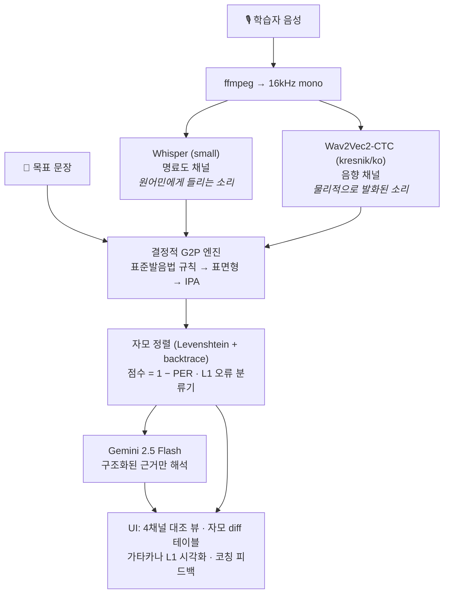

[🇺🇸 English](README.md) | [🇯🇵 日本語 (Japanese)](README_jp.md)

# 일본어 모어 화자를 위한 음소 수준 한국어 발음 코칭 🧑‍🏫

[](https://github.com/fairyofdata/PhonemeJP2KR/actions/workflows/ci.yml)

[](https://youtu.be/4SwwmzEcpZQ)

> 일본인 한국어 학습자를 위한 CAPT(컴퓨터 보조 발음 훈련) 웹 애플리케이션입니다. **듀얼 ASR 지각/산출 프로브**(Whisper × Wav2Vec2), **결정적(rule-based) 한국어 G2P 음운 규칙 엔진**, **LLM 해석 레이어**(Gemini)를 결합하여 자모(음소) 수준에서 발음 오류를 탐지·정량화·설명하고, 가타카나 역매핑으로 모어 간섭(L1 Interference)을 시각화합니다.

---

## 문제의식

성인 일본인 학습자의 한국어 발음 문제는 노력이 아니라 음운론에 뿌리를 둔 체계적 장벽입니다.

- **모라 박자 리듬** — 일본어 음소배열론은 개음절(CV)을 강하게 선호하므로, 학습자는 한국어 받침 뒤에 무의식적으로 모음을 삽입해 음절을 "수리"합니다 (*밥* /pap̚/ → *バプ* [bapɯ]).
- **2항 대립을 3항 대립에 대응** — 일본어는 유성/무성만 구별하지만 한국어는 평음/격음/경음(ㄱ/ㅋ/ㄲ)을 구별합니다. 학습자는 이 3항 대립을 붕괴시킵니다.
- **음운론적 난청 (Phonological Deafness)** — 모어의 지각 범주가 음향 신호를 인식 이전 단계에서 필터링하기 때문에, 학습자는 자신이 낸 소리와 의도한 소리의 차이를 문자 그대로 "들을 수 없습니다".

단어 단위 정오 판정만 제공하는 일반 발음 앱은 "왜 틀렸는지"를 지각하지 못하는 학습자에게 도움이 되지 않습니다. 이 프로젝트는 그 지각 격차 자체를 겨냥합니다.

## 설계 원칙

**LLM은 측정을 수행하지 않습니다.** LLM 기반 어학 도구의 흔한 실패 유형은 모델에게 "IPA로 전사하고 발음을 채점하라"고 요구하는 것입니다 — 결과는 그럴듯해 보이지만 비결정적이고 재현 불가능하며 환각에 취약합니다.

본 시스템은 다음과 같은 엄격한 분리를 강제합니다:

| 레이어 | 구성 요소 | 속성 |
|---|---|---|
| **측정** | 규칙 기반 G2P (표준발음법) + 자모 정렬 | 결정적, 단위 테스트 완료, 재현 가능 |
| **지각 프로브** | Whisper (강한 내부 LM) vs Wav2Vec2-CTC (LM 없음) | 두 출력의 *격차*가 명료도와 음향을 분리 |
| **해석** | Gemini 2.5 Flash — 구조화된 근거(오류 태그, IPA, 점수)를 입력받음 | 교육적 역할만: 가타카나 표기 + 코칭 텍스트 |

같은 음성은 항상 같은 점수를 산출합니다. LLM이 불가한 상황에서도 정량 분석 전체가 정상 표시됩니다.

## 아키텍처



**왜 듀얼 ASR인가?** Whisper는 강력한 언어 모델을 내장해 원어민 청자의 뇌가 하듯 발음 오류를 문맥으로 자동 보정합니다 — 출력이 *명료도(intelligibility)*를 근사합니다. 반면 greedy CTC 디코딩을 쓰는 Wav2Vec2는 언어 모델이 없어 출력이 실제 발화된 음소열에 가깝습니다 — *음향(acoustics)*. 두 채널의 발산이 바로 L2 학습자가 겪는 "내 실수를 내가 못 듣는" 격차이며, 이를 측정 가능하게 만든 것입니다.

## 결정적 G2P 엔진

[`src/g2p.py`](src/g2p.py)는 표준발음법의 주요 음운 규칙을 외부 의존성 없는 순수 Python 파이프라인으로 구현합니다:

| 규칙 | 표준발음법 | 예시 |
|---|---|---|
| ㅎ 격음화 / 탈락 | 제12항 | 좋다 → [조타], 좋아 → [조아], 입학 → [이팍] |
| 구개음화 | 제17항 | 같이 → [가치], 굳이 → [구지] |
| 연음 | 제13–14항 | 한국어 → [한구거], 없어요 → [업써요] |
| 받침 중화 (7종성) | 제8–11항 | 부엌 → [부억], 있다 → [읻따] |
| 경음화 | 제23항 | 학교 → [학꾜], 국밥 → [국빱] |
| 비음화 / 유음화 | 제18–20항 | 합니다 → [함니다], 신라 → [실라], 독립 → [동닙] |

표면형은 기본적인 변이음 규칙(모음 사이 평음 유성음화 /k/→[ɡ], 전설 활음 앞 ㅅ 구개음화 [s]→[ɕ])과 함께 IPA로 변환됩니다: `만나서 반갑습니다` → `/mannasʌ panɡap̚s͈ɯmnida/`.

목표 문장과 ASR 가설이 **모두** 같은 G2P를 통과하므로 표기 차이가 중화됩니다 — 예: *감사합니다*와 표면 표기 *감사함니다*는 동일하게 100점으로 채점됩니다.

## 점수화와 L1 오류 분류 체계

[`src/scoring.py`](src/scoring.py)는 두 자모 시퀀스를 Levenshtein DP(backtrace 포함)로 정렬하고 **점수 = round(100 × (1 − PER))**를 계산합니다. 정렬 결과는 다음 두 곳에 공급됩니다:

1. UI의 음소 단위 diff 테이블
2. 일본어 모어 간섭 패턴을 태깅하는 규칙 기반 분류기:

| 태그 | 언어학적 현상 | 예시 |
|---|---|---|
| `vowel_epenthesis` | 받침 뒤 모라 박자식 CV 수리 | 밥 → 바브 |
| `coda_deletion` | 받침 탈락 | 밥 → 바 |
| `laryngeal_confusion` | 평음/격음/경음 붕괴 | 딸 → 달 |
| `vowel_ʌ_o_confusion` | ㅓ/ㅗ 합류 (일본어에 /ʌ/ 없음) | 서울 → 소울 |
| `vowel_ɯ_u_confusion` | ㅡ/ㅜ 합류 (일본어에 /ɯ/ 없음) | 그 → 구 |
| `nasal_coda_confusion` | ㄴ/ㅇ이 일본어 撥音 ん으로 통합 | 산 → 상 |

이처럼 LLM은 날것의 문자열이 아닌 구조화된 태그를 전달받으므로, 추측이 아닌 구체적인 증거를 바탕으로 피드백을 제공합니다.

## 학술적 배경

Phomene의 아키텍처와 규칙 기반 오류 분류기는 대조음운론(Contrastive Phonology) 문헌에 엄밀하게 기초하고 있습니다. `src/scoring.py`에 구현된 규칙들은 일본인 한국어 학습자 대상의 실증적 연구들과 직접적으로 맞닿아 있습니다:

- **일본어식 음절화 및 모음 첨가 (`vowel_epenthesis`)**: 일본인 학습자는 무의식적으로 한국어의 종성을 일본어의 촉음(/Q/)이나 발음(/N/)으로 대체하며, 이로 인해 CVC 구조가 CV.CV 구조로 재음절화되는 현상이 발생합니다 (장향실, 2016; 하호빈·이화진, 2019).
- **과도한 조음 위치 동화 (`nasal_coda_confusion`)**: 일본인 학습자는 비음화 시 뒤따르는 자음의 조음 위치까지 불필요하게 복사(redundant place assimilation)하는 경향이 있습니다 (이화진, 2018).
- **Dual-ASR 검증**: 제2언어(L2) 화자의 발음 평가에서 단일 STT 모델이 갖는 한계가 최근 공식화되었으며, 이를 극복하기 위해 의도된 발음(형태소/LM 기반)과 실제 발음(음향 기반)의 괴리를 비교하는 방식이 학술적으로 지지받고 있습니다 (조현진·김병욱, 2023).

전체 참고 문헌 및 초록은 [`docs/REFERENCES.md`](docs/REFERENCES.md)에서 확인할 수 있습니다.

## 실증 검증 (Empirical Validation)

재현 가능한 실험 4종을 수행했습니다 ([`experiments/`](experiments/), 상세 보고서: [docs/EVALUATION.md](docs/EVALUATION.md)):

| # | 질문 | 결과 |
|---|---|---|
| 1 | LLM 생성 IPA는 유효한 채점기인가? | **아니오** — 동일 입력에 대해 v1 LLM 채점기는 10회 실행에서 89~93점으로 요동(sd 1.45), 같은 단어의 IPA 전사가 4가지로 상이. 결정적 채점기는 sd 0.0. |
| 2 | 파이프라인이 주입된 L1 오류를 탐지하는가? (TTS 섭동 실험) | 10개 문장 쌍에서 **순위 정확도 80%**, 평균 점수 갭 10.3점. 실패 2건은 모두 문서화된 ASR 오류 교란으로 소급되며 보고서에서 분석. |
| 3 | G2P 엔진이 개발 예제 밖으로 일반화되는가? | held-out 표준발음법 평가셋에서 **100% (51/51)**; 형태소 의존 항목은 0/9로 문서화된 적용 범위와 정확히 일치. CI에서 회귀 게이트로 실행. |
| 4 | 점수가 오류 *심각도*를 추적하는가? (0~3단계 등급 주입) | **Spearman ρ = −0.702** [95% CI −0.928, −0.325]; 심각도별 평균 점수 엄격 단조 감소(91.8→74.8), 단조 스텝 비율 87%. |

결정적 타당성 검증인 인간 평정 상관 연구는 설계와 분석 하네스가 완비된 상태입니다 (프로토콜: [docs/HUMAN_EVAL_PROTOCOL.md](docs/HUMAN_EVAL_PROTOCOL.md), 자가 테스트 완료 스크립트: [`experiments/exp5_human_correlation.py`](experiments/exp5_human_correlation.py)) — L2 녹음 데이터 확보만 남았습니다.

## 설치

```bash
git clone https://github.com/fairyofdata/PhonemeJP2KR
cd PhonemeJP2KR
python -m venv .venv && .venv/Scripts/activate   # 또는 source .venv/bin/activate
pip install -r requirements.txt
```

Gemini API 키([Google AI Studio](https://aistudio.google.com/) 무료 발급)를 환경 변수로 설정하세요:

```bash
# Windows (PowerShell)
$env:GEMINI_API_KEY = "your-key"
# macOS / Linux
export GEMINI_API_KEY="your-key"
```

또는 `.streamlit/secrets.toml`에 `GEMINI_API_KEY = "your-key"`를 추가해도 됩니다.

## 사용법

```bash
streamlit run app.py
```

1. (선택) 일본어 문장 입력 → 자연스러운 구어체 한국어로 자동 번역
2. 목표 문장 확인 — 표준 표면 발음과 IPA가 즉시 표시됩니다
3. 원어민 참조 음성 듣기 (edge-tts 뉴럴 보이스: SunHi / InJoon / Hyunsu)
4. 브라우저 마이크 녹음 또는 파일 업로드 후 분석 실행
5. 4채널 대조 뷰, 자모 수준 diff, 일본어 코칭 피드백 확인


## 테스트

언어학 코어는 완전히 단위 테스트되어 있습니다(47개): 표준발음법 기준 표면형 변환 30개 이상, IPA 매핑, 정렬 연산, 모든 L1 오류 태그 검증.

```bash
pip install -r requirements-dev.txt
python -m pytest tests/ -q
```

## 한계와 로드맵

규칙 엔진의 알려진 한계([`src/g2p.py`](src/g2p.py)에 문서화) — 모두 형태소 분석이 필요한 영역:
- 합성어 ㄴ첨가 (꽃잎 → [꼰닙])
- 문맥 의존적 겹받침 해소 (밟다 → [밥따] vs 여덟 → [여덜])
- 의미 경계 연음 예외 (맛없다 → [마덥따])

향후예정된 기능:
- **강제 정렬 (Forced alignment)** (예: CTC segmentation): 오류 발생 지점을 시간 축에서 특정하여 해당 구간만 다시 듣기
- **K-드라마 섀도잉 모드**: 인기 콘텐츠에서 추출한 목표 문장 프리셋 제공
- **형태소 인식 G2P**: 한국어 형태소 분석기를 연동한 G2P
- **ML 기반 L2 음향 모델로의 전환**: 현재의 결정론적 규칙 기반 L1 태거에서 나아가, 일본어 억양이 섞인 L2 한국어 데이터셋(예: NINJAL의 C-JAS, AI-Hub 외국인 한국어 발화 데이터)으로 Wav2Vec2를 파인튜닝하여 억양을 인지하는(accent-aware) 음향 모델 구축. 향후 확장을 위한 데이터 파이프라인 기초 코드는 [`src/data/l2_korean_dataset_builder.py`](src/data/l2_korean_dataset_builder.py)에 포함되어 있습니다.

## 라이선스

MIT License.
