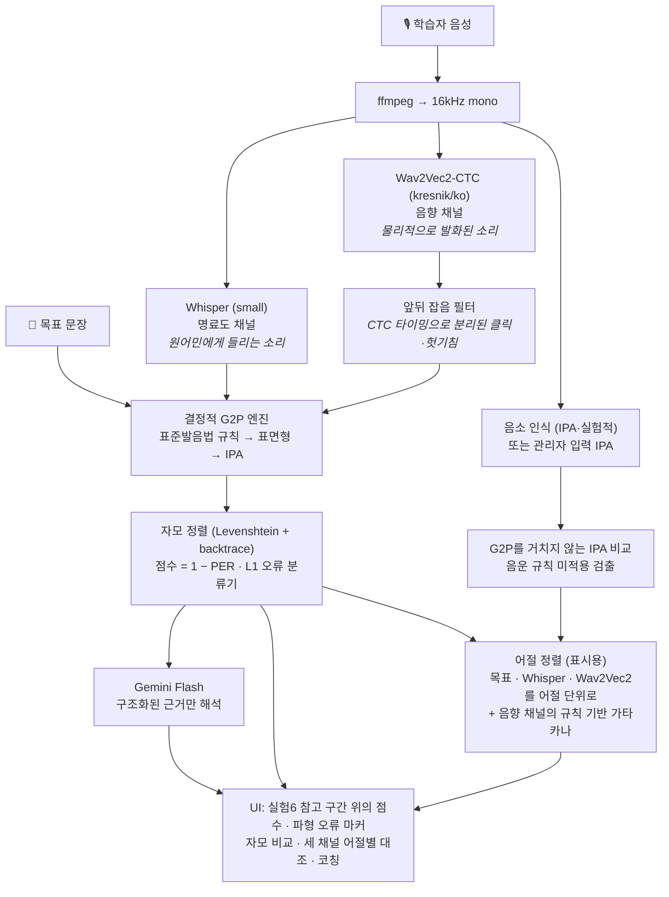

[🇺🇸 English](README.md) | [🇯🇵 日本語 (Japanese)](README_jp.md)

# 일본어 모어 화자를 위한 음소 수준 한국어 발음 코칭 🧑‍🏫

[](https://github.com/fairyofdata/PhonemeJP2KR/actions/workflows/ci.yml)

[](https://youtu.be/4SwwmzEcpZQ)

> 일본인 한국어 학습자를 위한 CAPT(컴퓨터 보조 발음 훈련) 웹 애플리케이션입니다. **듀얼 ASR 지각/산출 프로브**(Whisper × Wav2Vec2), **결정적(rule-based) 한국어 G2P 음운 규칙 엔진**, **LLM 해석 레이어**(Gemini)를 결합하여 자모(음소) 수준에서 발음 오류를 탐지·정량화·설명하고, 가타카나 역매핑으로 모어 간섭(L1 Interference)을 시각화합니다.

---

## 문제의식

성인 일본인 학습자의 한국어 발음 문제는 노력이 아니라 음운론에 뿌리를 둔 체계적 장벽입니다.

- **모라 박자 리듬** — 일본어 음소배열론은 개음절(CV)을 강하게 선호하므로, 학습자는 한국어 받침 뒤에 무의식적으로 모음을 삽입해 음절을 "수리"합니다 (*밥* /pap̚/ → *バプ* [bapɯ]).
- **2항 대립을 3항 대립에 대응** — 일본어는 유성/무성만 구별하지만 한국어는 평음/격음/경음(ㄱ/ㅋ/ㄲ)을 구별합니다. 학습자는 이 3항 대립을 붕괴시킵니다.
- **음운론적 난청 (Phonological Deafness)** — 모어의 지각 범주가 음향 신호를 인식 이전 단계에서 필터링하기 때문에, 학습자는 자신이 낸 소리와 의도한 소리의 차이를 문자 그대로 "들을 수 없습니다".

단어 단위 정오 판정만 제공하는 일반 발음 앱은 "왜 틀렸는지"를 지각하지 못하는 학습자에게 도움이 되지 않습니다. 이 프로젝트는 그 지각 격차 자체를 겨냥합니다.

## 설계 원칙

**LLM은 측정을 수행하지 않습니다.** LLM 기반 어학 도구의 흔한 실패 유형은 모델에게 "IPA로 전사하고 발음을 채점하라"고 요구하는 것입니다 — 결과는 그럴듯해 보이지만 비결정적이고 재현 불가능하며 환각에 취약합니다.

본 시스템은 다음과 같은 엄격한 분리를 강제합니다:

| 레이어 | 구성 요소 | 속성 |
|---|---|---|
| **측정** | 규칙 기반 G2P (표준발음법) + 자모 정렬 | 결정적, 단위 테스트 완료, 재현 가능 |
| **지각 프로브** | Whisper (강한 내부 LM) vs Wav2Vec2-CTC (LM 없음) | 두 출력의 *격차*가 명료도와 음향을 분리 |
| **음소 채널** | 다국어 음소 인식(IPA) 또는 입력한 IPA를 G2P 없이 비교 | 한글 채널로는 보이지 않는 음운 규칙 미적용을 검출 — 실험적 |
| **해석** | Gemini Flash(후보 목록 중 응답한 최신 모델) — 구조화된 근거(오류 태그, IPA, 점수)를 입력받음 | 교육적 역할만: 코칭 텍스트 |

같은 음성은 항상 같은 점수를 산출합니다. LLM이 불가한 상황에서도 정량 분석 전체가 정상 표시됩니다.

## 아키텍처


```mermaid
flowchart TD
    A[🎙️ 학습자 음성] --> B[ffmpeg → 16kHz mono]
    B --> C["Whisper (small)<br/>명료도 채널<br/><i>원어민에게 들리는 소리</i>"]
    B --> D["Wav2Vec2-CTC (kresnik/ko)<br/>음향 채널<br/><i>물리적으로 발화된 소리</i>"]
    T[🎯 목표 문장] --> G
    C --> G["결정적 G2P 엔진<br/>표준발음법 규칙 → 표면형 → IPA"]
    D --> N["앞뒤 잡음 필터<br/><i>CTC 타이밍으로 분리된 클릭·헛기침</i>"]
    N --> G
    G --> S["자모 정렬 (Levenshtein + backtrace)<br/>점수 = 1 − PER · L1 오류 분류기"]
    S --> W["어절 정렬 (표시용)<br/>목표 · Whisper · Wav2Vec2를 어절 단위로<br/>+ 음향 채널의 규칙 기반 가타카나"]
    B --> P["음소 인식 (IPA·실험적)<br/>또는 관리자 입력 IPA"]
    P --> I["G2P를 거치지 않는 IPA 비교<br/>음운 규칙 미적용 검출"]
    I --> W
    S --> L["Gemini Flash<br/>구조화된 근거만 해석"]
    L --> U["UI: 실험6 참고 구간 위의 점수 · 파형 오류 마커<br/>자모 비교 · 세 채널 어절별 대조 · 코칭"]
    S --> U
    W --> U
```

**왜 듀얼 ASR인가?** Whisper는 강력한 언어 모델을 내장해 원어민 청자의 뇌가 하듯 발음 오류를 문맥으로 자동 보정합니다 — 출력이 *명료도(intelligibility)*를 근사합니다. 반면 greedy CTC 디코딩을 쓰는 Wav2Vec2는 언어 모델이 없어 출력이 실제 발화된 음소열에 가깝습니다 — *음향(acoustics)*. 두 채널의 발산이 바로 L2 학습자가 겪는 "내 실수를 내가 못 듣는" 격차이며, 이를 측정 가능하게 만든 것입니다.

## 결정적 G2P 엔진

[`src/g2p.py`](src/g2p.py)는 표준발음법의 주요 음운 규칙을 외부 의존성 없는 순수 Python 파이프라인으로 구현합니다:

| 규칙 | 표준발음법 | 예시 |
|---|---|---|
| ㅎ 격음화 / 탈락 | 제12항 | 좋다 → [조타], 좋아 → [조아], 입학 → [이팍] |
| 구개음화 | 제17항 | 같이 → [가치], 굳이 → [구지] |
| 연음 | 제13–14항 | 한국어 → [한구거], 없어요 → [업써요] |
| 받침 중화 (7종성) | 제8–11항 | 부엌 → [부억], 있다 → [읻따] |
| 경음화 | 제23항 | 학교 → [학꾜], 국밥 → [국빱] |
| 비음화 / 유음화 | 제18–20항 | 합니다 → [함니다], 신라 → [실라], 독립 → [동닙] |
| 모음 실현 (ㅢ, 져/쪄/쳐) | 제5항 | 희망 → [히망], 회의 → [회이], 가져 → [가저] |

문맥 자유(context-free) 엔진이 볼 수 없는 *형태소 경계* 의존 규칙은 별도 레이어인 [`src/morphology.py`](src/morphology.py)가 담당합니다. Kiwipiepy 품사 분석기(결정성 보장을 위해 버전 고정)로 경계를 판별해 파이프라인 실행 전에 표기를 발음 철자로 재작성합니다. 계사/어미 구분이 핵심입니다 — 경계를 순진하게 판별하면 학생입니다가 \*[학쌩님니다]가 되지만, 이 레이어는 [학쌩임니다]를 유지합니다.

| 형태음운 규칙 | 표준발음법 | 예시 |
|---|---|---|
| 합성어 경계 ㄴ첨가 | 제29항 | 꽃잎 → [꼰닙], 한여름 → [한녀름] |
| 용언 어간말 경음화 | 제24–25항 | 신다 → [신따], 넓게 → [널께] |
| 어간 겹받침 해소 | 제10–11항 단서 | 밟다 → [밥따], 읽고 → [일꼬] |
| 실질형태소 앞 연음 차단 | 제15항 | 맛없다 → [마덥따] (제15항 다만: 맛있다 → [마싣따]) |
| 한자어 ㄴ+ㄹ → [ㄴㄴ] | 제20항 다만 | 의견란 → [의견난] (cf. 신라 → [실라]) |

Kiwipiepy가 설치되지 않은 환경에서는 문맥 자유 파이프라인으로 우아하게 성능 저하됩니다. 표면형은 기본적인 변이음 규칙(모음 사이 평음 유성음화 /k/→[ɡ], 전설 활음 앞 ㅅ 구개음화 [s]→[ɕ])과 함께 IPA로 변환됩니다: `만나서 반갑습니다` → `/mannasʌ panɡap̚s͈ɯmnida/`.

목표 문장과 ASR 가설이 **모두** 같은 G2P를 통과하므로 표기 차이가 중화됩니다 — 예: *감사합니다*와 표면 표기 *감사함니다*는 동일하게 100점으로 채점됩니다.

## 점수화와 L1 오류 분류 체계

[`src/scoring.py`](src/scoring.py)는 두 자모 시퀀스를 Levenshtein DP(backtrace 포함)로 정렬하고 **점수 = round(100 × (1 − PER))**를 계산합니다. 정렬 결과는 다음 두 곳에 공급됩니다:

1. UI의 음소 단위 diff 테이블
2. 일본어 모어 간섭 패턴을 태깅하는 규칙 기반 분류기:

| 태그 | 언어학적 현상 | 예시 |
|---|---|---|
| `vowel_epenthesis` | 받침 뒤 모라 박자식 CV 수리 | 밥 → 바브 |
| `coda_deletion` | 받침 탈락 | 밥 → 바 |
| `laryngeal_confusion` | 평음/격음/경음 붕괴 | 딸 → 달 |
| `vowel_ʌ_o_confusion` | ㅓ/ㅗ 합류 (일본어에 /ʌ/ 없음) | 서울 → 소울 |
| `vowel_ɯ_u_confusion` | ㅡ/ㅜ 합류 (일본어에 /ɯ/ 없음) | 그 → 구 |
| `vowel_jʌ_jo_confusion` | ㅓ/ㅗ 합류가 j-활음 뒤로 전이 | 여기 → 요기 |
| `diphthong_ɰi_monophthongization` | 어두 ㅢ의 단모음화 (일본어에 ɰ-활음 없음) | 의사 → 이사 |
| `nasal_coda_confusion` | ㄴ/ㅁ/ㅇ 받침이 일본어 撥音 ん으로 통합 | 산 → 상, 감 → 간 |
| `stop_coda_confusion` | 불파 받침 ㄱ/ㄷ/ㅂ의 조음 위치 상실 (促音 っ에는 고유 위치가 없음) | 밥 → 박 |

종성 태그는 음절 위치를 판별합니다: 초성 ㄴ/ㅁ, ㄱ/ㄷ/ㅂ 간 대치는 종성 오류로 태깅하지 않습니다. 이 분류 체계는 이유나(2022)가 정리한 일본인 학습자 빈발 오류 11개 범주 중 8개를 탐지하며, 나머지 3개(유·무성, 음운 규칙 적용, 억양)는 텍스트를 출력하는 ASR로는 구조적으로 관측할 수 없습니다 — 커버리지 감사: [`docs/L1_TAXONOMY.md`](docs/L1_TAXONOMY.md). 앱에서는 태그마다 대응 드릴이 있고, 학습 기록 탭이 태그를 누적해 학습자별 취약점 프로파일과 다음 드릴을 추천합니다.

이처럼 LLM은 날것의 문자열이 아닌 구조화된 태그를 전달받으므로, 추측이 아닌 구체적인 증거를 바탕으로 피드백을 제공합니다.

**앱의 점수 표시 방식.** 실험 6에 따르면 점수는 서열적으로 유효하지만 절대값은 보정되지 않았습니다(정확히 읽은 발화도 평균 79.6). 그래서 앱은 먼저 점수가 *정확히 읽은 발화의 분포*에서 어디에 놓이는지를 보여줍니다 — 중앙값(81) 이상: *정확한 낭독과 같은 수준*, p10–중앙값(68–80): *판단 보류, ASR 잡음과 오류가 겹치는 구간*, p10 미만: *정확한 낭독에서는 드문 점수* (실험 6의 편차 탐지 AUC가 0.717이므로 의도적으로 "오류"라고 단정하지 않음). 그 아래에 실제 점수와 같은 문장 직전 시도 대비 변화량을 표시합니다 — 실험 1·4가 가장 직접적으로 뒷받침하는 사용법입니다. 경계값은 `experiments/results/exp6_l2_validation.json`에서 읽으므로([`src/reference.py`](src/reference.py)), 파인튜닝 후 실험 6을 재실행하면 자동으로 갱신됩니다.

## 학술적 배경

규칙 기반 L1 오류 분류기는 일본인 한국어 학습자 대상 대조음운론 연구에 기초합니다. `src/scoring.py`의 각 오류 태그는 실증적으로 문서화된 현상에 대응합니다:

- **모음 첨가와 개음절화 (`vowel_epenthesis`, `coda_deletion`)**: 일본인 학습자는 한국어 종성을 일본어의 모라 단위인 촉음(/Q/)과 발음(撥音, /N/)에 대응시켜 CVC를 CV.CV로 수리하며, 종단 연구의 자연 발화 데이터에서도 개음절화와 종성 탈락이 지속적 오류 부류로 확인됩니다.
  - 🔗 [중국어와 일본어 모어 화자의 한국어 음절 종성 산출 차이 연구 (장향실, 우리어문연구, 2016)](https://www.dbpia.co.kr/journal/articleDetail?nodeId=NODE10761462)
  - 🔗 [음절 연쇄에서 나타나는 일본인 학습자의 한국어 종성 발음 유형 (하호빈·이화진, 언어사실과 관점, 2019)](https://www.dbpia.co.kr/journal/articleDetail?nodeId=NODE09235049)
  - 🔗 [일본인 학습자의 한국어 발음 오류에 대한 종적 연구 (이화진, 2021)](https://www.kci.go.kr/kciportal/ci/sereArticleSearch/ciSereArtiView.kci?sereArticleSearchBean.artiId=ART002730504)
- **모라 박자 리듬 전이**: 음향 지표(%V, VarcoV, VarcoS) 분석에서 고급 일본인 학습자도 한국어를 모라 박자 리듬으로 산출하며, 비음 종성을 가진 폐음절에서 편차가 가장 큽니다 — 자모 정렬이 표시하는 바로 그 환경입니다.
  - 🔗 [Native language interference in producing the Korean rhythmic structure: Focusing on Japanese (말소리와 음성과학 10(4))](https://www.eksss.org/archive/view_article?pid=pss-10-4-45)
- **비음화 과잉 동화 (`nasal_coda_confusion`)**: 비음화가 요구되는 환경에서 일본인 학습자는 후행 자음의 조음 위치를 불필요하게 복사(redundant place assimilation)합니다.
  - 🔗 [한국어 비음화의 오류 유형과 원인 분석 (이화진, 언어사실과 관점, 2018)](https://www.dbpia.co.kr/journal/articleDetail?nodeId=NODE08838909)
- **모음 체계 병합 (`vowel_ʌ_o_confusion`, `vowel_ɯ_u_confusion`)**: 일본어 모음 체계에 /ʌ/와 /ɯ/가 없어 발생하는 체계적 병합입니다.
  - 🔗 [모음 체계와 자질에 의한 일본인 학습자의 한국어 모음 발음 분석 (KCI)](https://www.kci.go.kr/kciportal/ci/sereArticleSearch/ciSereArtiView.kci?sereArticleSearchBean.artiId=ART002158469)
- **텍스트 유사도 = 명료도 프록시**: 원문과 ASR 전사 간 형태소 수준 유사도로 L2 한국어 발화를 채점하면 상용 발음평가 API보다 원어민 청취 결과에 더 근접한다는 연구가 있습니다 — ASR 출력에 대한 자모 수준 유사도 채점이라는 본 프로젝트의 선택을 독립적으로 뒷받침합니다.
  - 🔗 [형태소 분석기반 외국인 발화 한국어 발음평가 개선 방법 (DBpia)](https://www.dbpia.co.kr/journal/articleDetail?nodeId=NODE11438586)

- **커리큘럼과 분류 체계 커버리지**: 이유나(2022)는 대조 연구를 종합해 일본인 학습자 빈발 오류 11개 범주를 도출하고 이를 중심으로 ASR 기반 모바일 앱을 설계했으나, 구현과 효과 검증은 과제로 남겼습니다. 본 프로젝트는 그중 탐지 가능한 범주를 구현하고 나머지를 감사합니다. 같은 AI-Hub L2 코퍼스에 대한 코퍼스 연구(Yeo 외, 2023: 일본어 L1 고유의 /ɯ/ 삽입, L1 공통의 이중모음 단모음화·평음 대치)가 `vowel_epenthesis`, `diphthong_ɰi_monophthongization`, `laryngeal_confusion`을 뒷받침합니다.
  - 🔗 [일본인 학습자를 위한 한국어 발음 학습용 모바일 애플리케이션 설계 연구 (이유나, 경기대학교 석사학위논문, 2022)](https://www.dbpia.co.kr/journal/detail?nodeId=T16143963)
  - 🔗 [Comparison of L2 Korean pronunciation error patterns from five L1 backgrounds by using automatic phonetic transcription (Yeo 외, ICPhS 2023)](https://arxiv.org/abs/2306.10821)

전체 참고 문헌 및 초록은 [`docs/REFERENCES.md`](docs/REFERENCES.md)에서 확인할 수 있습니다. 파이프라인 설계 결정과 각 결정의 근거는 [`docs/DECISIONS.md`](docs/DECISIONS.md)에 기록되어 있습니다.

## 실증 검증 (Empirical Validation)

재현 가능한 실험 6종을 수행했습니다 ([`experiments/`](experiments/), 상세 보고서: [docs/EVALUATION.md](docs/EVALUATION.md)):

| # | 질문 | 결과 |
|---|---|---|
| 1 | LLM 생성 IPA는 유효한 채점기인가? | **아니오** — 동일 입력에 대해 v1 LLM 채점기는 10회 실행에서 89~93점으로 요동(sd 1.45), 같은 단어의 IPA 전사가 4가지로 상이. 결정적 채점기는 sd 0.0. |
| 2 | 파이프라인이 주입된 L1 오류를 탐지하는가? (TTS 섭동 실험) | 10개 문장 쌍에서 **순위 정확도 80%**, 평균 점수 갭 10.3점. 실패 2건은 모두 문서화된 ASR 오류 교란으로 소급되며 보고서에서 분석. |
| 3 | G2P 엔진이 개발 예제 밖으로 일반화되는가? | held-out 문맥 자유 규칙 **100% (51/51)** + 형태음운 규칙 **100% (17/17)**; 의미 의존적 사잇소리 항목은 0/5로 문서화된 적용 범위와 일치. CI에서 회귀 게이트로 실행. |
| 4 | 점수가 오류 *심각도*를 추적하는가? (0~3단계 등급 주입) | **Spearman ρ = −0.702** [95% CI −0.928, −0.325]; 심각도별 평균 점수 엄격 단조 감소(91.8→74.8), 단조 스텝 비율 87%. |
| 6 | **실제 일본어 억양 발화**에서도 점수가 신호를 갖는가? (AI-Hub L2 코퍼스 615클립, 화자 198명) | **서열적으로 유효** — 발화수준 상/하 분리 AUC 0.818, 인간 등급과 ρ = 0.473; 전사자가 들은 낭독 편차 탐지 AUC 0.717. 충실한 낭독에서의 ASR 노이즈 플로어(평균 79.6)도 실측 — 억양 파인튜닝 전까지 절대 점수는 보정되지 않음. |
| 6b | 고전 **GOP 베이스라인**(Witt & Young, 2000)을 능가하는가? | **전 지표에서 우세** — 동일 615클립·동일 음향 모델의 CTC 우도비 GOP 대비: 상/하 AUC 0.818 vs 0.606, 인간 등급 상관 0.473 vs 0.153, 편차 탐지 0.717 vs 0.635. "원시 모델 신뢰도가 아닌 텍스트 수준 유사도를 채점한다"는 핵심 설계의 실데이터 근거. |


발음 특화 평정(1~5점)에 의한 정밀 검증(실험 5)은 설계와 분석 하네스가 완비된 상태입니다 (프로토콜: [docs/HUMAN_EVAL_PROTOCOL.md](docs/HUMAN_EVAL_PROTOCOL.md), 자가 테스트 완료 스크립트: [`experiments/exp5_human_correlation.py`](experiments/exp5_human_correlation.py)) — 실험 6이 규모 축을, 실험 5가 정밀도 축을 담당합니다.

## 설치

**Windows에서 가장 간단한 방법:** 저장소를 내려받은 뒤 `run_app.bat`을 더블클릭하세요. 처음 실행할 때 `.venv`를 만들고 필요한 패키지(torch 포함 약 2GB)를 설치한 다음 앱을 띄웁니다. 두 번째부터는 몇 초 만에 시작합니다. `git pull` 이후 패키지를 다시 설치하려면 `run_app.bat --update`를 실행하세요.

직접 설치하거나 macOS / Linux를 쓰는 경우:

```bash
git clone https://github.com/fairyofdata/PhonemeJP2KR
cd PhonemeJP2KR
python -m venv .venv && .venv/Scripts/activate   # 또는 source .venv/bin/activate
pip install -r requirements.txt
```

Gemini API 키([Google AI Studio](https://aistudio.google.com/) 무료 발급)를 환경 변수로 설정하세요:

```bash
# Windows (PowerShell)
$env:GEMINI_API_KEY = "your-key"
# macOS / Linux
export GEMINI_API_KEY="your-key"
```

또는 프로젝트 루트의 `.env` 파일에 `GEMINI_API_KEY=your-key`를 적거나(git에 올라가지 않습니다), `.streamlit/secrets.toml`에 `GEMINI_API_KEY = "your-key"`를 추가해도 됩니다. 탐색 순서는 환경 변수 → `.env` → Streamlit secrets입니다. 키가 없어도 점수와 음소 분석은 그대로 동작하며, 코칭 문구와 일→한 번역만 표시되지 않습니다.

## 사용법

```bash
streamlit run app.py
```

1. 문장 선택 — 한국어 직접 입력, 일본어에서 생성(「日本語から作る」), 또는 사이드바의 약점 드릴 선택. 표준 표면 발음과 IPA가 즉시 표시됩니다
2. 원어민 참조 음성 듣기 (edge-tts 뉴럴 보이스: SunHi / InJoon / Hyunsu, 사이드바에서 선택)
3. 브라우저 마이크 녹음 또는 파일 업로드 후 분석 실행
4. 결과 확인 — 참고 구간과 점수(같은 문장 직전 시도 대비 변화 포함), 오류 위치가 빨간 마커로 표시된 파형 플레이어(Wav2Vec2-CTC 타임스탬프, 클릭 시 해당 위치 재생), 그리고 음절 단위 자모 비교·오류 목록 / 세 채널의 어절별 대조(오류가 있는 어절을 고르면 세 줄 대조·가타카나·태그별 일본어 설명 표시) / LLM 코칭 탭
5. 「学習記録」 탭에서 점수 추이와 반복되는 오류(약점 프로파일)를 확인하고, 지난 분석을 결과 화면으로 다시 열 수 있습니다 — 녹음은 최근 50건까지 보관되어 파형·마커 재생도 그대로 재현됩니다

*화려한 도시를 그리며 찾아왔네 그 곳은 춥고도 험한 곳*을 일본어 화자의 전형적인 방식으로 일본어 목소리가 읽은 예입니다. 음성은 관리자용 텍스트 입력에서 가나 대본(はりょはん どしるる ぐりみょ ちゃずあわっね …)을 TTS Nanami에게 읽히고, 그 읽기의 한글·IPA 전사를 함께 넣어 만들었습니다. 22음절 안에 연음·비음화(찾아왔네 → [차자완네]), 경음화(춥고도 → [춥꼬도]), 종성 중화(곳 → [곧])가 들어 있습니다.


*점수는 실험 6의 참고 구간 위에 놓이고, 빨간 마커는 CTC 타임스탬프로 각 오류 지점을 재생하며, 음절 단위로 묶인 자모 비교가 불일치마다 이름을 붙입니다.*


*같은 발화를 네 줄로 본 화면입니다 — 목표 문장, Whisper가 들은 것, 점수 계산에 쓰이는 음향 인식(아래에 가타카나), IPA 채널 — 을 어절별로 한글과 IPA로 맞추고, 목표와 다른 음소를 빨갛게 표시했습니다. 선택한 어절이 IPA 채널의 역할을 보여 줍니다. 실제 읽기 「차즈아왔네」는 G2P가 [차즈아완네]로 고쳐 버려서 한글 비교로는 모음 삽입만 보입니다. 음소로 비교하면 [tɕʰadʑɯawat̚ne]가 되어 비음화가 일어나지 않았다는 것([n]→[t])까지 드러납니다. 그 밖에도 일본어 화자의 전형적인 오류(ㅡ→ㅜ, ㅕ→ㅛ, 받침 뒤 모음 삽입, ㅓ→ㅗ)가 모여 있고, 오류가 있는 5어절은 목표와 읽기의 가타카나가 같습니다.*

**세 채널과 하나의 표기.** 측정 채널은 목표(표준 발음)·들린 것(Whisper)·실제 소리(Wav2Vec2, 점수의 근거) 세 개입니다. 가타카나는 네 번째 채널이 아니라 실제 소리 채널을 고정 규칙표([`src/kana.py`](src/kana.py))로 일본어 음운에 옮겨 적은 표기입니다. 평음/격음/경음, ㅓ/ㅗ, ㅡ/ㅜ, ㄴ/ㅇ 받침이 같은 글자로 뭉개진다는 점을 보여 주려고 두며, 목표와 Whisper에는 붙이지 않습니다. Wav2Vec2 출력에는 띄어쓰기가 없어서 채점과 같은 자모 정렬로 목표 문장의 어절에 잘라 맞춥니다([`src/words.py`](src/words.py)). 어절별 설명은 태그마다 정해진 문구이고 LLM을 쓰지 않습니다([`docs/DECISIONS.md`](docs/DECISIONS.md)의 결정 11). 모든 채널에 어절별 IPA를 함께 적고, 목표와 다른 음소를 빨갛게 표시합니다(ㅓ→ㅗ 옆에 [ʌ]→[o]). 네 번째 실험적 채널은 G2P를 거치지 않고 **음소**를 비교합니다([`src/ipa.py`](src/ipa.py)). 다국어 음소 인식 모델이나 관리자 입력으로 준 IPA를 목표의 표면형 IPA와 정렬하고, 규칙의 결과 대신 글자대로의 음이 나왔으면 어떤 규칙이 빠졌는지(경음화·비음화·유음화·격음화·구개음화·연음) 태그합니다. 한글 채널은 인식 결과를 같은 G2P로 다시 변환하기 때문에 이 오류만은 볼 수 없습니다(결정 13).

이 발화는 데이터로도 내보냅니다 — [`docs/assets/demo_take.json`](docs/assets/demo_take.json)(스키마는 [`docs/DEMO_TAKE.md`](docs/DEMO_TAKE.md)). 저장된 기록에서 `tools/export_demo_take.py`로 생성하며 모델이나 API를 호출하지 않습니다.


*LLM은 이 근거를 해석하기만 합니다 — 오류를 일본어 명칭으로 부르고 입 모양을 지시할 뿐, 점수를 다시 계산하지 않습니다.*

## 테스트

언어학 코어는 완전히 단위 테스트되어 있습니다(168개): 표준발음법 기준 표면형 변환 60개 이상(형태음운 규칙과 경계 오탐 회귀 가드 포함), IPA 매핑, 정렬 연산, CTC 타임스탬프 전파, 통계 유틸리티, 모든 L1 오류 태그 검증. 코어 주변부도 함께 검증합니다: 실험 6 결과에서 읽어오는 참고 구간, API 키 탐색 순서(환경 변수 → `.env` → secrets), 녹음 정리를 포함한 학습 기록 저장, 앞뒤 잡음 규칙(제거하면 **안 되는** 경우 포함), 관리자 입력의 CTC 강제 정렬, IPA 채널(규칙 미적용 태그 6종, 표기 정규화, 표시용 변이음), 띄어쓰기 없는 음향 출력의 어절 정렬과 가타카나 규칙표(뭉개져야 하는 대립 포함), 그리고 UI 마크업의 음절 묶기와 학습자·ASR·LLM 텍스트 이스케이프.

```bash
pip install -r requirements-dev.txt
python -m pytest tests/ -q
```

## 프로덕션 엔지니어링 및 운영 고려사항 (Production & Operations)

현실적인 서빙 환경에서의 저지연(Low-latency), 장애 허용성(Fault Tolerance), 예측 가능한 비용 관리를 위한 실무 설계:

- **장애 격리 및 Graceful Degradation**: 측정 레이어(결정론적 G2P, CTC 정렬, 음소 채점)는 LLM과 완전히 분리되어 있습니다. 외부 Gemini API 호출이 지연되거나 Rate Limit, 네트워크 단절이 발생하더라도 핵심 정량 분석과 음소 단위 오류 시각화는 100% 정상 작동합니다.
- **추론 지연시간(Latency) 및 메모리 관리**: 무거운 ASR 모델(Whisper & Wav2Vec2)은 `@st.cache_resource`를 통해 메모리 상에 싱글톤으로 캐싱되어 불필요한 콜드 스타트를 원천 차단합니다. 오디오 전처리는 최적화된 `ffmpeg` 파이프라인과 임시 파일 즉시 언링크(Unlink)를 결합하여 디스크 I/O 병목 및 메모리 누수를 방지합니다.
- **토큰 비용 최적화**: 고비용의 멀티모달 오디오 스트리밍 대신 로컬 음향 모델로 1차 정형화된 최소 진단 증거(`error_tags`, 표면형 IPA, 정렬 점수)만 Gemini Flash(`temperature=0.2`)로 전달하여 요청당 프롬프트 크기를 ~350 토큰 이내로 극대화하여 비용을 통제합니다.

## 한계와 로드맵

규칙 엔진의 알려진 한계([`src/g2p.py`](src/g2p.py)에 문서화):
- 고유어 합성어의 사잇소리 경음화 (강가 → [강까], 밤길 → [밤낄]) — 품사 태깅을 넘어선 의미론적 합성어 분석 필요
- 형태음운 규칙은 Kiwipiepy의 품사 중의성 해소에 의존 — 진성 중의 어절(예: 단독 '신고': 명사 [신고] vs 동사 [신꼬])은 Kiwi의 최우선 해석을 따름

녹음 시작·종료 버튼 소리나 헛기침은 언어 모델이 없는 음향 채널이 음절로 받아써서 삽입 오류로 채점될 수 있습니다. [`src/preprocess.py`](src/preprocess.py)는 이런 덩어리가 (1) 발화의 앞뒤 끝에 있고 (2) CTC 문자 타임스탬프 기준으로 본문과 간격이 떨어져 있으며 (3) 제거했을 때 점수가 올라가는 경우에만 제외합니다. 따라서 발음과 이어져 있는 모음 삽입(받침 뒤 ㅡ 등)은 제거되지 않습니다. 발화와 겹쳐 들어간 잡음은 이 방식으로 분리할 수 없습니다.

오류 분류 체계의 알려진 한계([`docs/L1_TAXONOMY.md`](docs/L1_TAXONOMY.md)): 유·무성, 음운 규칙 적용(예: 비음화 없이 [합니다]로 발음), 의문문 억양은 탐지할 수 없습니다. 음향 채널이 철자를 출력하고 G2P가 이를 다시 정규화하기 때문입니다.

향후 예정된 기능:
- **실험 7 — 어떤 오류 범주가 숙련도를 가르는가** ([`experiments/exp7_error_profile.py`](experiments/exp7_error_profile.py)): 실험 6 표본에서 태그별 상/중/하 발생률과 노이즈 기준선; 스크립트 완비, 데이터 머신에서 실행 대기
- **억양 채널** — ASR과 독립된 문말 F0 곡선 분석 (판정의문문 ↗, 설명의문문 ↘)
- **K-드라마 섀도잉 모드**: 인기 콘텐츠에서 추출한 목표 문장 프리셋 제공
- **일본어 억양 L2 한국어 음성으로 Wav2Vec2 파인튜닝**: [AI-Hub 외국인 한국어 발화 음성 데이터](https://aihub.or.kr/aihubdata/data/view.do?currMenu=115&topMenu=100&aihubDataSe=realm&dataSetSn=505) 일본어 모어 화자 Training 분할(낭독체 13.1만 발화, 화자 255명, 607시간)을 로컬 확보 완료 — 실험 6이 정량화한 ASR 노이즈 플로어(충실 낭독 평균 79.6)가 공략 목표. 단, 코퍼스 라벨이 철자 전사이므로 노이즈는 줄여도 음운 규칙 적용 오류를 드러내지는 못함 — 이는 발음 충실(음소 수준) 라벨이 필요

## 라이선스

MIT License.
