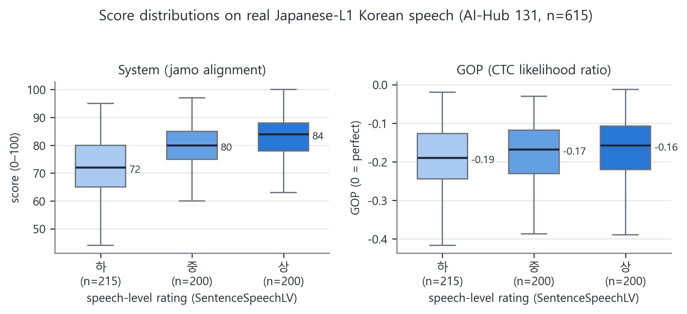

# Empirical Evaluation

Six executed experiments validate the system's core claims — including
real Japanese-accented Korean speech (Exp 6) and a head-to-head against
the classic GOP baseline (Exp 6b) — and a recruited-rater study (Exp 5)
is fully designed and harness-ready.
All scripts live in [`experiments/`](../experiments/) and write raw
results to `experiments/results/*.json`. Every number below is
reproducible by re-running the scripts (Exp 1 requires a Gemini API key;
Exp 2/4/6/6b require the ASR models; Exp 6/6b additionally require a local
copy of the AI-Hub corpus, which its license forbids redistributing).

---

## Experiment 1 — Reproducibility: LLM-generated IPA scoring (v1) vs deterministic G2P (v2)

**Question.** The pre-refactor system asked the LLM to transcribe both
sentences to IPA and scored the Levenshtein distance between those strings.
Is that a valid measurement instrument?

**Method.** The identical input pair (target 감사합니다, ASR hypothesis
감사하무니다 — a typical epenthesis error) was scored 10 times by each
method. v1 replicates the original prompt logic verbatim, including
`temperature=0.2`. Script: [`exp1_reproducibility.py`](../experiments/exp1_reproducibility.py).

**Results.**

| Method | mean | sd | range | distinct IPA transcriptions of the *same* target |
|---|---|---|---|---|
| v1 — LLM-generated IPA | 91.9 | 1.45 | 89–93 | **4** (`[kamsahamnida]`, `kamsahamnida`, `kɐm.sɐ.ɦɐm.ni.dɐ`, `[kam.sa.ham.ni.da]`) |
| v2 — deterministic G2P | 92.0 | **0.0** | 92–92 | 1 |

**Interpretation.** v1's score fluctuates over a 5-point range on identical
input because the LLM freely varies bracketing, syllable delimiters, and
vowel symbols (ɐ vs a, ɦ vs h) between calls — the Levenshtein distance then
measures transcription-style noise, not pronunciation. A learner practicing
the same sentence twice could see their "score" move without any change in
their speech. This experiment is the quantitative justification for the
measure-deterministically/interpret-with-LLM architecture.

---

## Experiment 2 — Discriminant validity via synthetic error injection

**Question.** Does the pipeline actually assign lower scores to speech
containing typical Japanese-L1 errors?

**Method.** For 10 target sentences, two clips were synthesized with the
same neural TTS voice: the correct sentence, and an error-injected version
encoding typical L1 patterns (vowel epenthesis, ㅓ→ㅗ, coda repair, …).
Both ran through the full pipeline (ffmpeg → Wav2Vec2 → G2P → jamo
alignment). Script: [`exp2_error_discrimination.py`](../experiments/exp2_error_discrimination.py).

**Results.**

| Metric | Value |
|---|---|
| Pairwise ranking accuracy (correct > error) | **8/10 (80%)** |
| Correct-audio score | 85.8 ± 23.5 |
| Error-audio score | 75.5 ± 17.3 |
| Mean gap | 10.3 points |

**Failure analysis (the interesting part).**

- **괜찮아요** (misranked): Wav2Vec2 transcribed even the *correct* native
  TTS clip as 근로아 (score 25). This is a direct instance of the documented
  confound — the acoustics channel cannot distinguish its own ASR error from
  a pronunciation error. Mitigation on the roadmap: fine-tuning on accented
  Korean and CTC-confidence gating.
- **맛있어요 → 마시소요** (tie): the ASR recognized the error-injected clip
  as the correct sentence, i.e. the acoustic model's implicit lexical bias
  "auto-corrected" the perturbation. Small segmental perturbations near
  high-frequency words can be absorbed by the recognizer.

**Threats to validity.** TTS renders segmental errors with native prosody,
so this is a controlled perturbation study of pipeline sensitivity — not an
evaluation on genuine L2 speech. The natural next step is a human-rater
correlation study (system score vs native-speaker ratings, Spearman ρ) on
recordings of Japanese learners; see Future Work.

---

## Experiment 3 — G2P engine accuracy on held-out data

**Question.** The rule engine was developed against ~30 textbook examples
(now unit tests). Does it generalize to unseen items?

**Method.** A 73-item evaluation set with gold labels from 표준국어대사전
pronunciation fields, in three buckets: 51 items exercising the
context-free rule pipeline (disjoint from the unit-test examples),
17 items exercising the morphology-conditioned layer (added with
`src/morphology.py`; serves as its regression gate), and 5 items that are
out of scope by design (사잇소리 tensification in native compounds, which
needs semantic compound analysis). Data:
[`experiments/data/g2p_heldout.tsv`](../experiments/data/g2p_heldout.tsv).
The core and morph buckets run in CI as a regression gate (`--check`).

**Results.**

| Bucket | Accuracy |
|---|---|
| Core (context-free phonological rules) | **51/51 = 100%** |
| Morph (morphology-conditioned, Kiwipiepy layer) | **17/17 = 100%** |
| Out-of-scope (semantics-dependent 사잇소리) | 0/5 = 0% (expected) |

The morphology-conditioned bucket covers the categories that were
out-of-scope failures before the Kiwipiepy layer existed: ㄴ-insertion
(꽃잎→[꼰닙]), stem tensification with POS disambiguation in context
(신발을 신고→[신바를 신꼬] vs the noun 신고→[신고]), exceptional cluster
resolution (밟다→[밥따]), liaison blocking (맛없다→[마덥따]), and
Sino-Korean ㄴ+ㄹ→[ㄴㄴ] (의견란→[의견난]). Remaining out-of-scope items
(강가→[강까], 밤길→[밤낄]) require knowing whether a compound is a native
사잇소리 compound — information not present in POS tags.

**Note on library comparison.** A head-to-head with `g2pK` was attempted but
the library cannot be installed on Windows/Python 3.13 (its `python-mecab-ko`
dependency fails to build). A comparison on Linux CI is future work.

---

## Experiment 4 — Graded severity monotonicity (human-rating surrogate)

**Question.** Without human ratings, can we still test whether the score
tracks error *severity*, not just error presence?

**Method.** For 5 base sentences, four TTS clips were synthesized at
severity 0–3, where severity *k* applies the first *k* cumulative error
injections (all attested Japanese-L1 patterns: epenthesis, ㅓ→ㅗ,
laryngeal confusion, coda repair, ŋ-loss). The injected error count is a
controlled ground-truth severity ordinal; a valid scorer must decrease
monotonically. 20 clips, full pipeline.
Script: [`exp4_severity_monotonicity.py`](../experiments/exp4_severity_monotonicity.py).

**Results.**

| Metric | Value |
|---|---|
| Spearman ρ (severity vs score) | **−0.702** [95% bootstrap CI −0.928, −0.325] |
| Mean score by severity 0→3 | 91.8 → 88.2 → 78.0 → 74.8 (strictly decreasing) |
| Monotonic step rate | 13/15 (87%) |
| Perfectly monotone sentences | 4/5 |

**Failure analysis.** The one non-monotone ladder (비빔밥을 먹었어요) had
its *severity-0* clip scored 71 — Wav2Vec2 misrecognized the correct
native TTS audio, the same ASR-error confound documented in Experiment 2.
One ladder (서울에서 만나요) plateaued at 85 for severities 1–3: the
recognizer absorbed the later perturbations, compressing ordinal
resolution at high error densities.

**Interpretation.** The CI excludes zero: the score is a statistically
significant monotone function of controlled error severity. Combined with
Exp 2 this establishes ordinal sensitivity; absolute calibration against
human judgment remains for Exp 5.

---

## Experiment 5 — Human-rater correlation study (designed; awaiting recordings)

The decisive validity test — system score vs native listeners' ratings of
genuine Japanese-accented Korean — cannot run until recordings exist.
Everything except the data is done:

- **Protocol** (materials, ≥5 speakers × 10 sentences, ≥3 native raters,
  anchored 1–5 intelligibility rubric, blinding, consent, pre-registered
  threshold ρ ≥ 0.6 and interpretation rules):
  [docs/HUMAN_EVAL_PROTOCOL.md](HUMAN_EVAL_PROTOCOL.md)
- **Analysis harness** (Spearman/Pearson + bootstrap CIs, inter-rater
  reliability, per-speaker breakdown; CSV in → JSON report out):
  [`exp5_human_correlation.py`](../experiments/exp5_human_correlation.py)
- **Harness verified** end-to-end via `--selftest` (synthesizes 5 TTS
  clips + dummy ratings and runs the identical code path).

The corpus-label route documented in the protocol (§9) has since been
executed as **Experiment 6** below: it validates the score against AI-Hub
human signals at scale, but its labels rate overall speech level and its
transcriptions are orthographic — the anchored pronunciation-specific
ratings of this protocol remain the missing precision axis.

---

## Experiment 6 — Validation on real Japanese-accented Korean speech (AI-Hub L2 corpus)

**Question.** Everything up to Exp 4 used synthetic (TTS-perturbed) audio.
Does the score carry signal on *genuine* L2 speech — and how much of it is
drowned by the ASR-error confound that Exp 2/4 identified?

**Data.** AI-Hub dataset 131 (외국인 한국어 발화 음성 데이터, Japanese-L1
subset), Validation split: 16,435 read-aloud utterances with three human
signals per clip — the script the learner read (`Reading`), what native
transcribers actually heard (`ReadingLabelText`, deviating from the script
in ~20% of clips), and a per-utterance speech-level rating
(`SentenceSpeechLV` 상/중/하). A stratified sample of **615 clips from 198
speakers** (all 215 하-rated read-aloud clips + 200 each of 상/중, fixed
seed) ran through the full acoustics pipeline (Wav2Vec2-CTC → G2P → jamo
alignment). Script: [`exp6_l2_validation.py`](../experiments/exp6_l2_validation.py);
the corpus itself is license-restricted and stays local (gitignored).

**Results.**

| Axis | Metric | Value |
|---|---|---|
| A. Agreement with human transcribers | Spearman ρ, system score vs jamo deviation transcribers heard | **0.322** [95% CI 0.246, 0.391] |
| | AUC detecting transcriber-noted reading deviations | **0.717** [0.665, 0.764] |
| B. Proficiency association | Spearman ρ, system score vs speech-level rating | **0.473** [0.409, 0.535] |
| | AUC 상 vs 하 / 상 vs 중 / 중 vs 하 | **0.818** / 0.637 / 0.720 |
| | Speaker-level ρ vs TOPIK grade (n=55 speakers) | 0.317 |
| | Mean system score by level 상/중/하 | 83.1 / 79.2 / 71.8 (monotone) |
| ASR noise floor | Mean system-vs-heard score on faithful readings (n=483) | **79.6** (median 81, p10 68) |

**Interpretation.**

1. **The ordinal signal is real.** On genuine accented speech the score
   separates 상 from 하 speech-level ratings at AUC 0.818 and decreases
   monotonically across levels. This is the first evidence on real L2
   audio, not synthetic perturbations.
2. **Absolute scores are not calibrated.** Even when transcribers heard a
   faithful reading, the acoustics channel scored it 79.6 on average —
   the ASR-error confound of Exp 2/4, now quantified on real data. A
   learner-facing absolute score ("your pronunciation is 80/100") is not
   defensible with the current off-the-shelf acoustic model; rankings and
   within-learner progress deltas are.
3. **The floor is partly signal, not noise.** 하-rated speakers also read
   faithfully (mean heard-score 98.8 vs 99.7 for 상) — the transcription
   channel is ceiling-limited — yet the system still separates the levels.
   The acoustics channel is responding systematically to accent strength,
   which is exactly the property a pronunciation scorer needs; fine-tuning
   should convert this raw sensitivity into calibrated measurement.

**Threats to validity.** `SentenceSpeechLV` rates overall speech level
(fluency included), not pronunciation alone, and speakers skew proficient
(TOPIK 5–6) — both attenuate correlations (range restriction), so the
reported values are conservative lower bounds. `ReadingLabelText` is
orthographic: transcribers normalise phone-level accent into standard
spelling, so axis A validates *deviation detection*, not fine phonetic
scoring. Axis-A ρ is further attenuated by the ceiling in heard scores
(median 100 at every level).

---

## Experiment 6b — GOP baseline: three-way comparison on the same sample

**Question.** The field's classic pronunciation scorer is Goodness of
Pronunciation (Witt & Young, 2000) — a likelihood-ratio statistic from the
acoustic model, no text decoding involved. Does this project's
decode-then-align approach actually beat it, or merely differ from it?

**Method.** A CTC variant of GOP was computed for the same 615 clips from
the same Wav2Vec2 model the pipeline already uses:
`GOP = (ll_forced − ll_free) / n_frames`, where `ll_forced` is the CTC
log-likelihood of the target transcript (summed over all valid alignments)
and `ll_free` is the unconstrained greedy-path log-likelihood — the
standard denominator that cancels audio-quality and duration effects. The
CTC target is the orthographic script (the model's own training-transcript
convention; 0.27% of target tokens are out-of-vocabulary and dropped,
touching 77/615 clips). Script:
[`exp6b_gop_baseline.py`](../experiments/exp6b_gop_baseline.py); raw
results: [`exp6b_gop_threeway.json`](../experiments/results/exp6b_gop_threeway.json).

**Results — System (jamo alignment) vs GOP against every human signal:**

| Metric | System | GOP |
|---|---|---|
| Spearman ρ vs transcriber-heard deviation | **0.322** [0.246, 0.391] | 0.197 [0.120, 0.266] |
| Deviation-detection AUC | **0.717** [0.665, 0.764] | 0.635 [0.582, 0.683] |
| Spearman ρ vs speech-level rating | **0.473** [0.409, 0.535] | 0.153 [0.073, 0.228] |
| AUC 상 vs 하 / 상 vs 중 / 중 vs 하 | **0.818** / 0.637 / 0.720 | 0.606 / 0.541 / 0.568 |
| Speaker-level ρ vs TOPIK | **0.317** | 0.144 |

Scorer agreement: ρ(System, GOP) = 0.666 — correlated but far from
redundant.

**Interpretation.** The alignment-based score dominates the GOP baseline
on every axis, and the margin is largest exactly where it matters for a
CAPT product (상/하 discrimination: 0.818 vs 0.606). A plausible
mechanism: the likelihood ratio absorbs everything that makes the audio
unlike the model's training distribution — channel, speaking rate,
accent-global effects — while decoding-then-aligning quantises frame-level
uncertainty into a discrete hypothesis before comparison, discarding
nuisance variance but keeping segmental errors. This is independent,
real-data support for the project's core architectural bet (score text-level
similarity over ASR output rather than raw model confidences), consistent
with the morpheme-similarity findings of the 발음평가 개선 literature cited
in the README.

**Threats to validity.** This GOP is utterance-level and uses the same
non-adapted acoustic model as the system — it is a fair same-budget
baseline, not the strongest possible GOP (phone-level GOP over a
fine-tuned, phoneme-output model would be stronger, and is exactly what
the fine-tuning roadmap enables). Both scorers share one acoustic model,
so their errors are not independent.

---

## Future Work (evaluation)

1. **Execute Experiment 5** — collect recordings per
   [HUMAN_EVAL_PROTOCOL.md](HUMAN_EVAL_PROTOCOL.md) with anchored 1–5
   *pronunciation* ratings; Exp 6 covered the scale axis with corpus
   labels, Exp 5 covers the precision axis that those labels cannot
   (speech-level ratings conflate fluency; transcriptions are
   orthographic).
2. ~~GOP baseline~~ — **done as Experiment 6b** (utterance-level CTC-GOP;
   the alignment-based method wins on every axis). The remaining stronger
   variant — phone-level GOP over a fine-tuned phoneme-output model — folds
   into item 3.
3. **Accent-aware acoustic model** — fine-tune Wav2Vec2 on the AI-Hub
   Japanese-L1 training split (131k read-aloud utterances, 255 speakers,
   607 h, acquired locally and CRC-verified via `tools/verify_aihub131.py`).
   Success criterion is now concrete, thanks to Exp 6: raise the
   faithful-reading noise floor (79.6) toward the high 90s while keeping
   or improving the 상/하 AUC (0.818), then re-run the Exp 6b three-way
   comparison including phone-level GOP.
